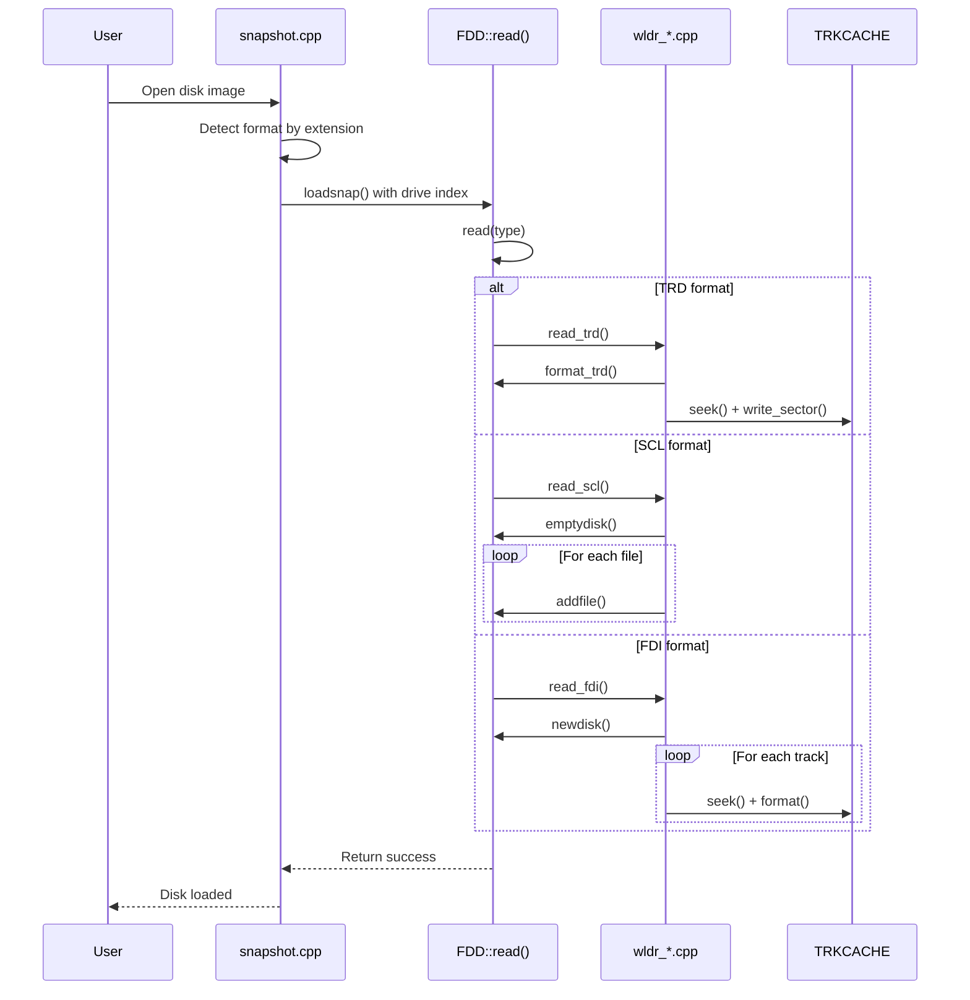
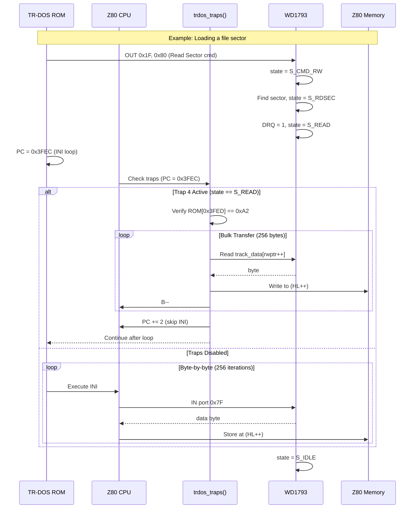
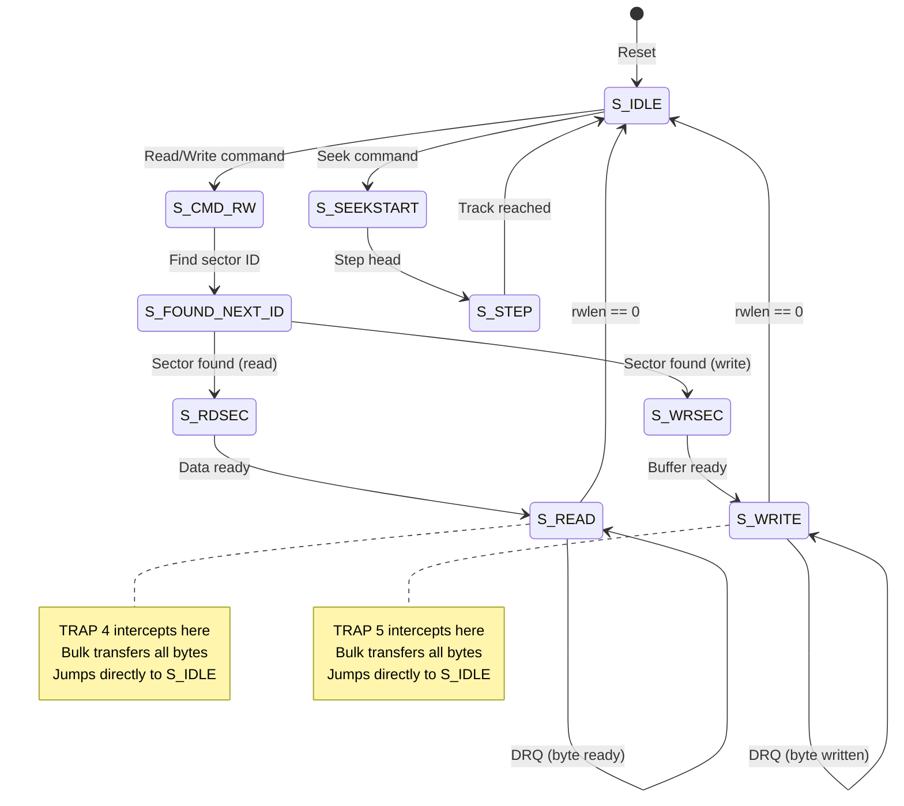
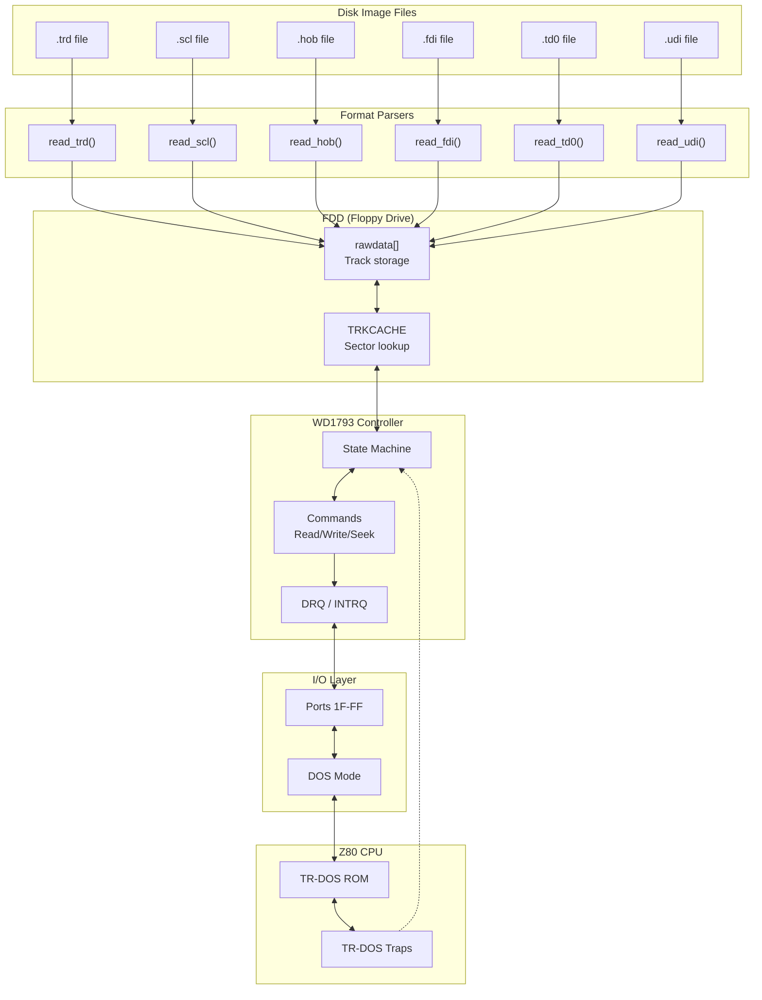
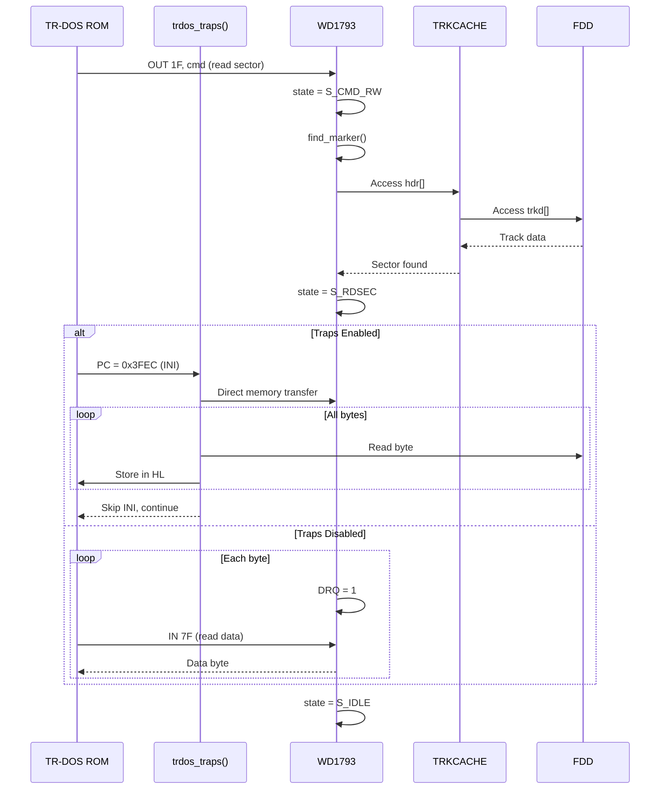

# Disk Loading Architecture

This document provides a comprehensive overview of the disk loading subsystem in UnrealSpeccy, including the WD1793 floppy disk controller emulation, TR-DOS disk operating system support, supported disk image formats, and acceleration mechanisms.

---

## Table of Contents

1. [Overview](#overview)
2. [Hardware Emulation](#hardware-emulation)
   - [WD1793 Floppy Disk Controller](#wd1793-floppy-disk-controller)
   - [Beta Disk Interface](#beta-disk-interface)
   - [FDD (Floppy Disk Drive)](#fdd-floppy-disk-drive)
3. [Supported Disk Formats](#supported-disk-formats)
   - [TRD (TR-DOS Image)](#trd-tr-dos-image)
   - [SCL (Sinclair Copy Loader)](#scl-sinclair-copy-loader)
   - [HOB (Single File)](#hob-single-file)
   - [FDI (UKV Spectrum Debugger)](#fdi-ukv-spectrum-debugger)
   - [TD0 (Teledisk)](#td0-teledisk)
   - [UDI (Ultra Disk Image)](#udi-ultra-disk-image)
   - [ISD (Inlay Disk)](#isd-inlay-disk)
   - [PRO (Professional Copy)](#pro-professional-copy)
4. [TR-DOS Integration](#tr-dos-integration)
5. [Loading Pipeline](#loading-pipeline)
6. [Disk Traps (Acceleration)](#disk-traps-acceleration)
7. [Disk Saving](#disk-saving)
8. [Configuration Options](#configuration-options)
9. [Data Flow Diagrams](#data-flow-diagrams)
10. [Source Code References](#source-code-references)

---

## Overview

The disk subsystem emulates the Beta Disk Interface, which was the most popular floppy disk add-on for the ZX Spectrum in Eastern Europe. It provides:

- **WD1793 controller emulation** — Full state machine for read/write operations
- **4 virtual floppy drives** — A:, B:, C:, D:
- **Multiple image formats** — 8 different formats supported
- **TR-DOS traps** — Acceleration for standard disk operations
- **Write support** — Modified disks can be saved back

```
┌─────────────────────────────────────────────────────────────────┐
│                   Disk Subsystem Overview                       │
├─────────────────────────────────────────────────────────────────┤
│                                                                 │
│  ┌─────────────┐    ┌─────────────────┐    ┌──────────────┐     │
│  │ Disk Image  │───▶│  Format Parser  │───▶│     FDD      │     │
│  │ .trd/.scl/  │    │  read_trd()     │    │   rawdata    │     │
│  │ .fdi/etc    │    │  read_scl()     │    │   tracks     │     │
│  └─────────────┘    │  read_fdi()...  │    │   sectors    │     │
│                     └─────────────────┘    └──────┬───────┘     │
│                                                   │             │
│                     ┌─────────────────┐           │             │
│                     │   Track Cache   │◀──────────┤             │
│                     │   TRKCACHE      │           │             │
│                     │   - seek()      │           │             │
│                     │   - format()    │           │             │
│                     └────────┬────────┘           │             │
│                              │                    │             │
│                     ┌────────▼────────┐           │             │
│                     │     WD1793      │           │             │
│                     │   Controller    │───────────┘             │
│                     │   - state       │                         │
│                     │   - commands    │                         │
│                     │   - DRQ/INTRQ   │                         │
│                     └────────┬────────┘                         │
│                              │                                  │
│                     ┌────────▼────────┐                         │
│                     │  Beta Disk I/O  │                         │
│                     │  Ports 1F-FF    │                         │
│                     └────────┬────────┘                         │
│                              │                                  │
│                     ┌────────▼────────┐                         │
│                     │   Z80 CPU       │                         │
│                     │   (TR-DOS)      │                         │
│                     └─────────────────┘                         │
│                                                                 │
└─────────────────────────────────────────────────────────────────┘
```

---

## Hardware Emulation

### WD1793 Floppy Disk Controller

The WD1793 (also known as FD1793) is the floppy disk controller chip used in the Beta Disk Interface. UnrealSpeccy provides a full state machine emulation.

#### Controller Registers

| Port | Name | Read | Write |
|------|------|------|-------|
| 0x1F | Status/Command | Status register | Command register |
| 0x3F | Track | Current track | Set track |
| 0x5F | Sector | Current sector | Set sector |
| 0x7F | Data | Read data | Write data |
| 0xFF | System | Status + drive/side | Drive select, side, motor |

#### Status Register Bits

```
┌─────────────────────────────────────────────────────────────────┐
│                   WD1793 Status Register                        │
├─────────────────────────────────────────────────────────────────┤
│                                                                 │
│  Bit 7: NOT READY    (drive not ready)                          │
│  Bit 6: WRITE PROT   (disk is write protected)                  │
│  Bit 5: HEAD LOAD    (head loaded) / RECORD TYPE / WRITE FAULT  │
│  Bit 4: SEEK ERROR   (seek failed) / NOT FOUND (sector)         │
│  Bit 3: CRC ERROR    (data CRC mismatch)                        │
│  Bit 2: TRACK 00     (at track 0) / LOST DATA                   │
│  Bit 1: INDEX        (index pulse) / DRQ (data request)         │
│  Bit 0: BUSY         (command in progress)                      │
│                                                                 │
└─────────────────────────────────────────────────────────────────┘
```

#### Controller State Machine

The WD1793 emulation uses a state machine defined in `wd93.h`:

```cpp
enum WDSTATE
{
    S_IDLE = 0,          // No operation
    S_WAIT,              // Waiting for timing
    S_DELAY_BEFORE_CMD,  // Pre-command delay
    S_CMD_RW,            // Read/Write command processing
    S_FOUND_NEXT_ID,     // Found sector ID address mark
    S_RDSEC,             // Reading sector
    S_READ,              // Read data transfer
    S_WRSEC,             // Writing sector
    S_WRITE,             // Write data transfer
    S_WRTRACK,           // Format track (write track)
    S_WR_TRACK_DATA,     // Format track data phase
    S_TYPE1_CMD,         // Type I command (seek/step/restore)
    S_STEP,              // Step head
    S_SEEKSTART,         // Begin seek
    S_SEEK,              // Seeking track
    S_VERIFY,            // Verify track after seek
    S_RESET              // Controller reset
};
```

#### WD1793 Commands

```
┌─────────────────────────────────────────────────────────────────┐
│                   WD1793 Command Set                            │
├──────────────────┬──────────────────────────────────────────────┤
│ Type I Commands  │ Seek, Step, Restore                          │
│ (Head movement)  │ Bits 0-1: Step rate (6/12/20/30 ms)          │
│                  │ Bit 4: Update track register                 │
│                  │ Bit 5: 0=step in, 1=step out                 │
├──────────────────┼──────────────────────────────────────────────┤
│ Type II Commands │ Read Sector, Write Sector                    │
│ (Data transfer)  │ Bit 0: Deleted data mark                     │
│                  │ Bit 1: Side compare                          │
│                  │ Bit 4: Multiple sectors                      │
├──────────────────┼──────────────────────────────────────────────┤
│ Type III Commands│ Read Address, Read Track, Write Track        │
│ (Track-level)    │ Used for disk formatting                     │
├──────────────────┼──────────────────────────────────────────────┤
│ Type IV Command  │ Force Interrupt                              │
│                  │ Terminates any command in progress           │
└──────────────────┴──────────────────────────────────────────────┘
```

### Beta Disk Interface

The Beta Disk Interface maps the WD1793 to Z80 I/O ports in the TR-DOS ROM page:

```cpp
// Port decoding (io.cpp)
// When in DOS mode (CF_DOSPORTS flag set):

// Port 0x1F, 0x3F, 0x5F, 0x7F - WD1793 registers
if ((p1 & 0x1F) == 0x1F) {
    comp.wd.out(p1, val);  // Write
    return comp.wd.in(p1); // Read
}
```

#### System Port (0xFF) Bits

```
┌─────────────────────────────────────────────────────────────────┐
│               Beta Disk System Port (0xFF)                      │
├─────────────────────────────────────────────────────────────────┤
│                                                                 │
│  Write bits:                                                    │
│  Bit 0-1: Drive select (0=A, 1=B, 2=C, 3=D)                     │
│  Bit 2:   Reserved                                              │
│  Bit 3:   Head load (HLT)                                       │
│  Bit 4:   Side select (0=bottom, 1=top)                         │
│  Bit 5:   Reserved                                              │
│  Bit 6:   Density (0=FM, 1=MFM) - always MFM                    │
│  Bit 7:   Reserved                                              │
│                                                                 │
│  Read bits:                                                     │
│  Bit 6:   DRQ (Data Request - ready for data transfer)          │
│  Bit 7:   INTRQ (Interrupt Request - command complete)          │
│                                                                 │
└─────────────────────────────────────────────────────────────────┘
```

### FDD (Floppy Disk Drive)

Each virtual floppy drive is represented by an `FDD` structure:

```cpp
struct FDD
{
    u8 Id;                       // Drive index (0-3 = A-D)
    __int64 motor;               // Motor state (0=stopped)
    unsigned char track;         // Current head position

    unsigned char *rawdata;      // Disk image data
    unsigned rawsize;            // Allocated size
    unsigned cyls, sides;        // Disk geometry

    unsigned trklen[MAX_CYLS][2];   // Track lengths
    unsigned char *trkd[MAX_CYLS][2]; // Track data pointers
    unsigned char *trki[MAX_CYLS][2]; // Track index marks

    unsigned char optype;        // Modification flags
    unsigned char snaptype;      // Image format type

    TRKCACHE t;                  // Track cache
    char name[0x200];            // Filename
    char dsc[0x200];             // Disk description
};
```

#### Track Cache

The track cache (`TRKCACHE`) provides efficient sector access:

```cpp
struct TRKCACHE
{
    FDD *drive;              // Associated drive
    unsigned cyl, side;      // Cached track position
    unsigned trklen;         // Track length in bytes
    unsigned char *trkd;     // Track data pointer
    unsigned char *trki;     // Index mark bitmap
    unsigned ts_byte;        // T-states per byte
    unsigned s;              // Number of sectors
    SECHDR hdr[MAX_SEC];     // Sector headers

    void seek(FDD *d, unsigned cyl, unsigned side, SEEK_MODE fs);
    void format();           // Format track
    int write_sector(unsigned sec, unsigned char *data);
    const SECHDR *get_sector(unsigned sec) const;
};
```

---

## Supported Disk Formats

UnrealSpeccy supports 8 different disk image formats, each with specific characteristics:

### Format Comparison

| Format | Extension | Read | Write | Description |
|--------|-----------|------|-------|-------------|
| TRD | `.trd` | ✓ | ✓ | Raw TR-DOS disk image |
| SCL | `.$c` | ✓ | ✗ | Sinclair Copy Loader archive |
| HOB | `.$h`, `.$b`, etc. | ✓ | ✗ | Single TR-DOS file (Hobbit) |
| FDI | `.fdi` | ✓ | ✓ | Full Disk Image (with headers) |
| TD0 | `.td0` | ✓ | ✓ | Teledisk format |
| UDI | `.udi` | ✓ | ✓ | Ultra Disk Image (raw stream) |
| ISD | `.isd` | ✓ | ✓ | Inlay Disk format |
| PRO | `.pro` | ✓ | ✓ | Professional Copy format |

### TRD (TR-DOS Image)

The most common format, representing a raw TR-DOS disk:

```
┌─────────────────────────────────────────────────────────────────┐
│                   TRD File Structure                            │
├─────────────────────────────────────────────────────────────────┤
│                                                                 │
│  Total size: 640KB (80 tracks × 2 sides × 16 sectors × 256)     │
│                                                                 │
│  Track 0, Side 0:                                               │
│  ├── Sector 1-8: Directory entries (128 files max)              │
│  └── Sector 9:   Disk descriptor                                │
│                                                                 │
│  Sector 9 Layout (Disk Descriptor):                             │
│  ┌─────────┬─────────────────────────────────────────────┐      │
│  │ Offset  │ Description                                 │      │
│  ├─────────┼─────────────────────────────────────────────┤      │
│  │ 0x00    │ Zero                                        │      │
│  │ 0x01    │ Reserved (224 bytes)                        │      │
│  │ 0xE1    │ First free sector                           │      │
│  │ 0xE2    │ First free track                            │      │
│  │ 0xE3    │ Disk type (16/17/18/19)                     │      │
│  │ 0xE4    │ File count                                  │      │
│  │ 0xE5-E6 │ Free sector count                           │      │
│  │ 0xE7    │ TR-DOS signature (0x10)                     │      │
│  │ 0xF5-FC │ Disk label (8 chars)                        │      │
│  └─────────┴─────────────────────────────────────────────┘      │
│                                                                 │
│  Disk Types:                                                    │
│  ├── 0x16: Double-sided, 80 tracks (DS_80) - 640KB              │
│  ├── 0x17: Double-sided, 40 tracks (DS_40) - 320KB              │
│  ├── 0x18: Single-sided, 80 tracks (SS_80) - 320KB              │
│  └── 0x19: Single-sided, 40 tracks (SS_40) - 160KB              │
│                                                                 │
└─────────────────────────────────────────────────────────────────┘
```

```cpp
// wldr_trd.cpp - TRD loading
int FDD::read_trd()
{
    format_trd();  // Create formatted disk structure
    for (unsigned i = 0; i < snapsize; i += 0x100)
    {
        t.seek(this, i>>13, (i>>12) & 1, LOAD_SECTORS);
        t.write_sector(((i>>8) & 0x0F)+1, snbuf+i);
    }
    return 1;
}
```

### SCL (Sinclair Copy Loader)

Archive format containing multiple TR-DOS files:

```
┌─────────────────────────────────────────────────────────────────┐
│                   SCL File Structure                            │
├─────────────────────────────────────────────────────────────────┤
│                                                                 │
│  Header:                                                        │
│  ┌─────────┬─────────────────────────────────────────────┐      │
│  │ Offset  │ Description                                 │      │
│  ├─────────┼─────────────────────────────────────────────┤      │
│  │ 0x00-07 │ Signature "SINCLAIR"                        │      │
│  │ 0x08    │ File count                                  │      │
│  └─────────┴─────────────────────────────────────────────┘      │
│                                                                 │
│  File Entries (14 bytes each):                                  │
│  ┌─────────┬─────────────────────────────────────────────┐      │
│  │ Offset  │ Description                                 │      │
│  ├─────────┼─────────────────────────────────────────────┤      │
│  │ 0x00-07 │ Filename (8 chars)                          │      │
│  │ 0x08    │ File type (B/C/D/#)                         │      │
│  │ 0x09-0A │ Start address                               │      │
│  │ 0x0B-0C │ Length                                      │      │
│  │ 0x0D    │ Sector count                                │      │
│  └─────────┴─────────────────────────────────────────────┘      │
│                                                                 │
│  File data follows (sector count × 256 bytes per file)          │
│                                                                 │
└─────────────────────────────────────────────────────────────────┘
```

Loading creates an empty TRD disk and adds files:

```cpp
int FDD::read_scl()
{
    emptydisk();  // Create empty TR-DOS disk
    TSclHdr *SclHdr = (TSclHdr *)snbuf;

    // Add each file from the archive
    for (i = 0; i < SclHdr->FileCnt; i++)
    {
        addfile((u8 *)&SclHdr->Files[i], data);
        data += SclHdr->Files[i].SecCnt * 0x100;
    }
    return 1;
}
```

### HOB (Single File)

Hobeta format for individual TR-DOS files:

```
┌─────────────────────────────────────────────────────────────────┐
│                   HOB File Structure                            │
├─────────────────────────────────────────────────────────────────┤
│                                                                 │
│  Header (17 bytes):                                             │
│  ┌─────────┬─────────────────────────────────────────────┐      │
│  │ Offset  │ Description                                 │      │
│  ├─────────┼─────────────────────────────────────────────┤      │
│  │ 0x00-07 │ Filename (8 chars)                          │      │
│  │ 0x08    │ File type                                   │      │
│  │ 0x09-0A │ Start address                               │      │
│  │ 0x0B-0C │ Length in bytes                             │      │
│  │ 0x0D    │ Reserved                                    │      │
│  │ 0x0E    │ Sector count                                │      │
│  │ 0x0F-10 │ Checksum                                    │      │
│  └─────────┴─────────────────────────────────────────────┘      │
│                                                                 │
│  Data follows (sector_count × 256 bytes)                        │
│                                                                 │
│  Extension indicates file type:                                 │
│  .$B = BASIC, .$C = Code, .$D = Data, .$# = Screen              │
│                                                                 │
└─────────────────────────────────────────────────────────────────┘
```

### FDI (Full Disk Image)

Extended format with sector-level information:

```
┌─────────────────────────────────────────────────────────────────┐
│                   FDI File Structure                            │
├─────────────────────────────────────────────────────────────────┤
│                                                                 │
│  Header (14 bytes):                                             │
│  ┌─────────┬─────────────────────────────────────────────┐      │
│  │ Offset  │ Description                                 │      │
│  ├─────────┼─────────────────────────────────────────────┤      │
│  │ 0x00-02 │ Signature "FDI"                             │      │
│  │ 0x03    │ Flags                                       │      │
│  │ 0x04-05 │ Cylinder count                              │      │
│  │ 0x06-07 │ Side count                                  │      │
│  │ 0x08-09 │ Description offset                          │      │
│  │ 0x0A-0B │ Data offset                                 │      │
│  │ 0x0C-0D │ Header extension                            │      │
│  └─────────┴─────────────────────────────────────────────┘      │
│                                                                 │
│  Track headers (7 bytes each + 7 bytes per sector)              │
│  Sector data follows                                            │
│                                                                 │
└─────────────────────────────────────────────────────────────────┘
```

### TD0 (Teledisk)

Industry-standard format with optional compression:

```
┌─────────────────────────────────────────────────────────────────┐
│                   TD0 File Structure                            │
├─────────────────────────────────────────────────────────────────┤
│                                                                 │
│  Signature: "TD" (uncompressed) or "td" (LZH compressed)        │
│                                                                 │
│  Header (12 bytes):                                             │
│  ┌─────────┬─────────────────────────────────────────────┐      │
│  │ Offset  │ Description                                 │      │
│  ├─────────┼─────────────────────────────────────────────┤      │
│  │ 0x00-01 │ Signature ("TD" or "td")                    │      │
│  │ 0x04    │ Teledisk version                            │      │
│  │ 0x07    │ Flags (bit 7 = has comment)                 │      │
│  │ 0x09    │ Sides                                       │      │
│  │ 0x0A-0B │ Header CRC                                  │      │
│  └─────────┴─────────────────────────────────────────────┘      │
│                                                                 │
│  Optional comment record                                        │
│  Track/sector data following                                    │
│                                                                 │
└─────────────────────────────────────────────────────────────────┘
```

### UDI (Ultra Disk Image)

Raw track data with index mark information:

```
┌─────────────────────────────────────────────────────────────────┐
│                   UDI File Structure                            │
├─────────────────────────────────────────────────────────────────┤
│                                                                 │
│  Header (16 bytes):                                             │
│  ┌─────────┬─────────────────────────────────────────────┐      │
│  │ Offset  │ Description                                 │      │
│  ├─────────┼─────────────────────────────────────────────┤      │
│  │ 0x00-03 │ Signature "UDI!"                            │      │
│  │ 0x04-07 │ File size                                   │      │
│  │ 0x08    │ Version                                     │      │
│  │ 0x09    │ Cylinders - 1                               │      │
│  │ 0x0A    │ Sides - 1                                   │      │
│  │ 0x0B    │ Flags (bit 0 = has description)             │      │
│  │ 0x0C-0F │ Reserved                                    │      │
│  └─────────┴─────────────────────────────────────────────┘      │
│                                                                 │
│  Track data (3-byte header + data + index marks):               │
│  ├── Byte 0: Type (0 = MFM)                                     │
│  ├── Bytes 1-2: Track length                                    │
│  ├── Track data bytes                                           │
│  └── Index mark bitmap                                          │
│                                                                 │
│  Optional description + CRC32                                   │
│                                                                 │
└─────────────────────────────────────────────────────────────────┘
```

---

## TR-DOS Integration

TR-DOS (Technology Research DOS) is the disk operating system used with the Beta Disk Interface. UnrealSpeccy provides tight integration:

### DOS Mode Activation

TR-DOS is activated when the Z80 accesses specific memory addresses:

```cpp
// Defined in emul.h
#define CF_DOSPORTS  0x01   // DOS ports active
#define CF_TRDOS     0x02   // DOSEN trigger (PC in 0x3Dxx range)
```

The Beta Disk ROM (located at 0x0000-0x3FFF when in DOS mode) handles all disk operations.

### File Operations

TR-DOS supports these file types:

| Type | Extension | Description |
|------|-----------|-------------|
| B | BASIC | BASIC program |
| C | Code | Machine code |
| D | Data | Array data |
| # | Screen | Screen data (6912 bytes) |

### Sector Interleaving

For optimal performance, TR-DOS uses sector interleaving:

```cpp
// wldr_trd.cpp - Interleave patterns
static const unsigned char lv[3][16] = {
    { 1,2,3,4,5,6,7,8,9,10,11,12,13,14,15,16 },  // No interleave
    { 1,9,2,10,3,11,4,12,5,13,6,14,7,15,8,16 },  // 1:2 interleave
    { 1,12,7,2,13,8,3,14,9,4,15,10,5,16,11,6 }   // 1:3 interleave
};
```

The interleave setting (`conf.trdos_interleave`) affects formatting:

```cpp
for (unsigned sn = 0; sn < 16; sn++) {
    unsigned s = lv[conf.trdos_interleave][sn];
    t.hdr[sn].n = s, t.hdr[sn].l = 1;
    // ...
}
```

---

## Loading Pipeline

### Format Detection

Disk format is detected by file extension and content:

```cpp
// snapshot.cpp
if (snapsize >= 8192 && !(snapsize & 0xFF) && 
    ext == WORD4('t','r','d',' ')) 
    type = snTRD;

if (ext == WORD4('s','c','l',' ')) {
    if (memcmp(snbuf, "SINCLAIR", 8) == 0)
        type = snSCL;
}
```

### Loading Sequence



---

## Disk Traps (Acceleration)

Similar to tape traps, disk traps accelerate standard TR-DOS operations by intercepting specific ROM addresses. The `trdos_traps()` function is called during Z80 execution when `conf.trdos_traps` is enabled.

### How Disk Traps Work

```
┌─────────────────────────────────────────────────────────────────┐
│                   Disk Trap Hook Mechanism                      │
├─────────────────────────────────────────────────────────────────┤
│                                                                 │
│  Z80 Execution Loop (z80_main.inl)                              │
│  ┌───────────────────────────────────────────────────────────┐  │
│  │                                                           │  │
│  │   while (cpu.t < cpu.tpi) {                               │  │
│  │       execute_instruction();                              │  │
│  │                                                           │  │
│  │       // Check for disk traps when in DOS mode            │  │
│  │       if (conf.trdos_traps && dos_mode_active) {          │  │
│  │           comp.wd.trdos_traps();  ◄─── HOOK POINT         │  │
│  │       }                                                   │  │
│  │   }                                                       │  │
│  │                                                           │  │
│  └───────────────────────────────────────────────────────────┘  │
│                                                                 │
│  Trap addresses are in TR-DOS ROM (0x3D00-0x3FFF range)         │
│                                                                 │
└─────────────────────────────────────────────────────────────────┘
```

### TR-DOS ROM Memory Map (Trap Regions)

```
┌─────────────────────────────────────────────────────────────────┐
│                TR-DOS ROM Trap Addresses                        │
├─────────────────────────────────────────────────────────────────┤
│                                                                 │
│  0x0000 ┌──────────────────────────────────┐                    │
│         │                                  │                    │
│         │     TR-DOS ROM Code              │                    │
│         │     (Command processing,         │                    │
│         │      file operations, etc.)      │                    │
│         │                                  │                    │
│  0x3DFD ├──────────────────────────────────┤ ◄── TRAP 1         │
│         │  Post-command delay loop         │     Skip delay     │
│         │  LD A, xx ; DEC C                │                    │
│  0x3E01 ├──────────────────────────────────┤ ◄── TRAP 3         │
│         │  Delay counter check             │     Fast return    │
│         │  DEC C                           │                    │
│         ├──────────────────────────────────┤                    │
│         │                                  │                    │
│  0x3EA0 ├──────────────────────────────────┤ ◄── TRAP 2         │
│         │  Motor spinup delay              │     Skip spinup    │
│         │  LD B, xx ; LD A, yy             │                    │
│         ├──────────────────────────────────┤                    │
│         │                                  │                    │
│  0x3FD1 ├──────────────────────────────────┤ ◄── TRAP 5         │
│         │  Sector write loop               │     Fast write     │
│         │  OUTI ; JR NZ, ...               │                    │
│         ├──────────────────────────────────┤                    │
│  0x3FEC ├──────────────────────────────────┤ ◄── TRAP 4         │
│         │  Sector read loop                │     Fast read      │
│         │  INI ; JR NZ, ...                │                    │
│  0x3FFF └──────────────────────────────────┘                    │
│                                                                 │
└─────────────────────────────────────────────────────────────────┘
```

### Trap Algorithm (Pseudo-Code)

```
╔═══════════════════════════════════════════════════════════════╗
║                    trdos_traps() Algorithm                    ║
╚═══════════════════════════════════════════════════════════════╝

FUNCTION trdos_traps():
    
    pc ← cpu.pc AND 0xFFFF
    
    // Early exit: traps only exist in high ROM area
    IF pc < 0x3DFD:
        RETURN
    
╔═══════════════════════════════════════════════════════════════╗
║  TRAP 1: Post-Command Delay Skip (0x3DFD)                     ║
║  Skips the delay loop after WD1793 commands complete          ║
╚═══════════════════════════════════════════════════════════════╝
    
    IF pc == 0x3DFD AND memory[0x3DFD] == 0x3E:    // LD A, nn
        // Pop return address from stack (simulate RET)
        low_byte  ← read_memory(SP++)
        high_byte ← read_memory(SP++)
        cpu.pc ← (high_byte << 8) | low_byte
        
        // Signal success (no error, no timeout)
        cpu.A ← 0
        cpu.C ← 0
        RETURN

╔═══════════════════════════════════════════════════════════════╗
║  TRAP 2: Motor Spinup Skip (0x3EA0)                           ║
║  Skips the ~1 second motor spinup delay                       ║
╚═══════════════════════════════════════════════════════════════╝
    
    IF pc == 0x3EA0 AND memory[0x3EA0] == 0x06:    // LD B, nn
        // Pop return address from stack (simulate RET)
        low_byte  ← read_memory(SP++)
        high_byte ← read_memory(SP++)
        cpu.pc ← (high_byte << 8) | low_byte
        
        // Signal motor ready
        cpu.A ← 0
        cpu.B ← 0
        RETURN

╔═══════════════════════════════════════════════════════════════╗
║  TRAP 3: Fast Delay Return (0x3E01)                           ║
║  Instantly completes counter-based delays                     ║
╚═══════════════════════════════════════════════════════════════╝
    
    IF pc == 0x3E01 AND memory[0x3E01] == 0x0D:    // DEC C
        // Set both A and C to 1 (loop complete signal)
        cpu.A ← 1
        cpu.C ← 1
        RETURN    // Continue at same PC, but loop will exit

╔═══════════════════════════════════════════════════════════════╗
║  TRAP 4: Fast Sector Read (0x3FEC)                            ║
║  Transfers entire sector directly, bypassing INI loop         ║
╚═══════════════════════════════════════════════════════════════╝
    
    IF pc == 0x3FEC AND controller.state == S_READ:
        // Verify we're in the INI instruction at correct address
        IF memory[0x3FED] != 0xA2:    // INI opcode check
            RETURN
        
        // Check DRQ (Data Request) is active
        IF controller.rqs AND DRQ:
            // Transfer pending byte first
            write_memory(cpu.HL, controller.data)
            cpu.HL++
            cpu.B--
            controller.rqs AND= NOT DRQ
        
        // Bulk transfer remaining bytes
        WHILE controller.rwlen > 0:
            byte ← track_data[controller.rwptr++]
            write_memory(cpu.HL, byte)
            cpu.HL++
            cpu.B--
            controller.rwlen--
        
        cpu.pc ← cpu.pc + 2    // Skip INI instruction
        RETURN

╔═══════════════════════════════════════════════════════════════╗
║  TRAP 5: Fast Sector Write (0x3FD1)                           ║
║  Transfers entire sector directly, bypassing OUTI loop        ║
╚═══════════════════════════════════════════════════════════════╝
    
    IF pc == 0x3FD1 AND controller.state == S_WRITE:
        // Verify we're in the OUTI instruction
        IF memory[0x3FD2] != 0xA3:    // OUTI opcode check
            RETURN
        
        // Check DRQ is active and we have data to write
        IF (controller.rqs AND DRQ) AND controller.rwlen > 1:
            // Bulk transfer from memory to track
            WHILE controller.rwlen > 1:
                byte ← read_memory(cpu.HL)
                track.write(controller.rwptr++, byte)
                cpu.HL++
                cpu.B--
                controller.rwlen--
            
            cpu.pc ← cpu.pc + 2    // Skip OUTI instruction
        RETURN
```

### Detailed Trap Descriptions

#### Trap 1: Post-Command Delay (0x3DFD)

When the WD1793 completes a command, TR-DOS waits for the controller to settle:

```
TR-DOS ROM at 0x3DFD:
    3DFD: LD A, nn      ; 3E xx - Load delay counter
    3DFF: DEC C         ; 0D    - Decrement outer counter
    3E00: JR NZ, loop   ; 20 xx - Continue if not zero
    
Without trap: Executes delay loop (~500,000 T-states)
With trap:    Immediately returns with A=0, C=0 (success)
```

#### Trap 2: Motor Spinup (0x3EA0)

Before accessing the disk, the motor must be ON and spinning at full speed:

```
TR-DOS ROM at 0x3EA0:
    3EA0: LD B, nn      ; 06 xx - Outer loop counter
    3EA2: LD A, yy      ; 3E yy - Inner delay value
    ...                 ; Nested delay loops
    
Without trap: Waits ~1 second for motor to reach speed
With trap:    Returns immediately (motor is virtual, always ready)
```

#### Trap 3: Fast Delay Return (0x3E01)

Generic delay loop escape:

```
TR-DOS ROM at 0x3E01:
    3E01: DEC C         ; 0D    - Decrement counter
    3E02: JR NZ, ...    ; Continue if C != 0
    
Without trap: Loops until C reaches 0
With trap:    Sets A=C=1, loop exits on next iteration
```

#### Trap 4: Fast Sector Read (0x3FEC)

The TR-DOS sector read loop uses the Z80 `INI` instruction to transfer data:

```
┌─────────────────────────────────────────────────────────────────┐
│              INI Instruction Operation                          │
├─────────────────────────────────────────────────────────────────┤
│                                                                 │
│  INI = IN (HL), (C) ; HL++ ; B--                                │
│                                                                 │
│  For a 256-byte sector:                                         │
│  - 256 × INI instructions                                       │
│  - Each INI = 16 T-states                                       │
│  - Plus loop overhead = ~21 T-states per byte                   │
│  - Total: 256 × 21 = 5,376 T-states per sector                  │
│                                                                 │
│  With trap:                                                     │
│  - Single bulk memory copy                                      │
│  - ~256 T-states total                                          │
│  - Speedup: ~21x per sector                                     │
│                                                                 │
└─────────────────────────────────────────────────────────────────┘

TR-DOS ROM at 0x3FEC:
    3FEC: INI           ; ED A2 - Input byte to (HL), HL++, B--
    3FEE: JR NZ, 3FEC   ; 20 xx - Loop until B = 0
```

#### Trap 5: Fast Sector Write (0x3FD1)

Similar to read, but uses `OUTI` for output:

```
┌─────────────────────────────────────────────────────────────────┐
│              OUTI Instruction Operation                         │
├─────────────────────────────────────────────────────────────────┤
│                                                                 │
│  OUTI = OUT (C), (HL) ; HL++ ; B--                              │
│                                                                 │
│  For a 256-byte sector:                                         │
│  - 256 × OUTI instructions                                      │
│  - Each OUTI = 16 T-states                                      │
│  - Plus loop overhead = ~21 T-states per byte                   │
│  - Total: 256 × 21 = 5,376 T-states per sector                  │
│                                                                 │
│  With trap:                                                     │
│  - Single bulk memory copy to track buffer                      │
│  - Speedup: ~21x per sector                                     │
│                                                                 │
└─────────────────────────────────────────────────────────────────┘

TR-DOS ROM at 0x3FD1:
    3FD1: OUTI          ; ED A3 - Output (HL) to port, HL++, B--
    3FD3: JR NZ, 3FD1   ; 20 xx - Loop until B = 0
```

### Trap Verification Mechanism

Each trap verifies the ROM content before activating to ensure compatibility:

```
┌─────────────────────────────────────────────────────────────────┐
│                 ROM Signature Verification                      │
├────────────┬──────────────┬─────────────────────────────────────┤
│ Address    │ Expected     │ Instruction                         │
├────────────┼──────────────┼─────────────────────────────────────┤
│ 0x3DFD     │ 0x3E         │ LD A, nn                            │
│ 0x3EA0     │ 0x06         │ LD B, nn                            │
│ 0x3E01     │ 0x0D         │ DEC C                               │
│ 0x3FED     │ 0xA2         │ INI (second byte of ED A2)          │
│ 0x3FD2     │ 0xA3         │ OUTI (second byte of ED A3)         │
└────────────┴──────────────┴─────────────────────────────────────┘

This prevents traps from activating on non-standard or modified TR-DOS ROMs.
```

### Trap Flow Diagram



### State Machine Interaction



### Trap Summary Table

| Trap | Address | ROM Check | Condition | Action | T-States Saved |
|------|---------|-----------|-----------|--------|----------------|
| 1 | 0x3DFD | 0x3E (LD A) | Always | Pop return, A=C=0 | ~500,000 |
| 2 | 0x3EA0 | 0x06 (LD B) | Always | Pop return, A=B=0 | ~3,500,000 |
| 3 | 0x3E01 | 0x0D (DEC C) | Always | A=C=1 | ~10,000 |
| 4 | 0x3FEC | 0xA2 (INI) | state==S_READ | Bulk read | ~5,000/sector |
| 5 | 0x3FD1 | 0xA3 (OUTI) | state==S_WRITE | Bulk write | ~5,000/sector |

### Performance Impact

```
┌─────────────────────────────────────────────────────────────────┐
│              Disk Operation Speed Comparison                    │
├────────────────────────────┬────────────────────────────────────┤
│  Operation                 │  Without Traps  │  With Traps      │
├────────────────────────────┼─────────────────┼──────────────────┤
│  Load 48K file (192 sec)   │  ~8 seconds     │  ~0.5 seconds    │
│  Save 48K file (192 sec)   │  ~8 seconds     │  ~0.5 seconds    │
│  Format disk (2560 sec)    │  ~80 seconds    │  ~5 seconds      │
│  Directory listing (CAT)   │  ~2 seconds     │  ~0.1 seconds    │
│  Motor spinup              │  ~1 second      │  ~0 seconds      │
└────────────────────────────┴─────────────────┴──────────────────┘

Total acceleration: 10-20x faster than real hardware speed
```

### Annotated Implementation

```cpp
// wd93cmd.cpp - Complete annotated implementation
void WD1793::trdos_traps()
{
    // ========================================================
    // PHASE 1: Early exit for addresses outside trap range
    // ========================================================
    unsigned pc = (cpu.pc & 0xFFFF);
    if (pc < 0x3DFD) return;  // All traps are >= 0x3DFD

    // ========================================================
    // TRAP 1: Post-command delay skip (0x3DFD)
    // Original ROM code: LD A, nn ; outer delay loop
    // ========================================================
    if (pc == 0x3DFD && bankr[0][0x3DFD] == 0x3E)  // Verify LD A opcode
    {
        // Simulate RET: pop return address from stack
        cpu.pc = cpu.DbgMemIf->rm(cpu.sp++);
        cpu.pc |= (cpu.DbgMemIf->rm(cpu.sp++) << 8);
        
        // Signal success to TR-DOS
        cpu.a = 0;  // No error
        cpu.c = 0;  // Counter exhausted
    }

    // ========================================================
    // TRAP 2: Motor spinup delay skip (0x3EA0)
    // Original ROM code: LD B, nn ; LD A, yy ; delay loops
    // ========================================================
    if (pc == 0x3EA0 && bankr[0][0x3EA0] == 0x06)  // Verify LD B opcode
    {
        // Simulate RET: pop return address from stack
        cpu.pc = cpu.DbgMemIf->rm(cpu.sp++);
        cpu.pc |= (cpu.DbgMemIf->rm(cpu.sp++) << 8);
        
        // Signal motor ready
        cpu.a = 0;  // No timeout
        cpu.b = 0;  // Counter exhausted
    }

    // ========================================================
    // TRAP 3: Fast delay return (0x3E01)
    // Original ROM code: DEC C ; JR NZ, loop
    // ========================================================
    if (pc == 0x3E01 && bankr[0][0x3E01] == 0x0D)  // Verify DEC C opcode
    {
        cpu.a = cpu.c = 1;  // Force loop exit on next iteration
        return;  // No delays
    }

    // ========================================================
    // TRAP 4: Fast sector read (0x3FEC)
    // Original ROM code: INI ; JR NZ, $-2
    // Condition: WD1793 must be in S_READ state
    // ========================================================
    if (pc == 0x3FEC && bankr[0][0x3FED] == 0xA2 &&  // Verify INI opcode
        (state == S_READ || (state2 == S_READ && state == S_WAIT)))
    {
        trdos_load = ROMLED_TIME;  // Activate disk LED
        
        // Transfer pending DRQ byte first
        if (rqs & DRQ) {
            cpu.DbgMemIf->wm(cpu.hl, data);
            cpu.hl++, cpu.b--;
            rqs &= ~DRQ; status &= ~WDS_DRQ;
        }

        // Bulk transfer remaining bytes from track buffer
        if (seldrive->t.trkd) {
            while (rwlen) {
                cpu.DbgMemIf->wm(cpu.hl, seldrive->t.trkd[rwptr++]);
                rwlen--;
                cpu.hl++; cpu.b--;
            }
        }
        
        cpu.pc += 2;  // Skip INI instruction
        return;
    }

    // ========================================================
    // TRAP 5: Fast sector write (0x3FD1)
    // Original ROM code: OUTI ; JR NZ, $-2
    // Condition: WD1793 must be in S_WRITE state with DRQ
    // ========================================================
    if (pc == 0x3FD1 && bankr[0][0x3FD2] == 0xA3 &&  // Verify OUTI opcode
        (rqs & DRQ) && (rwlen > 1) &&
        (state == S_WRITE || (state2 == S_WRITE && state == S_WAIT)))
    {
        trdos_save = ROMLED_TIME;  // Activate disk LED
        
        // Bulk transfer from memory to track buffer
        while (rwlen > 1) {
            seldrive->t.write(rwptr++, cpu.DbgMemIf->rm(cpu.hl), 0);
            rwlen--;
            cpu.hl++; cpu.b--;
        }
        
        cpu.pc += 2;  // Skip OUTI instruction
        return;
    }
}
```

### Why These Specific Addresses?

The trap addresses correspond to the most time-consuming loops in the standard TR-DOS 5.03 ROM:

```
┌─────────────────────────────────────────────────────────────────┐
│            TR-DOS Time Distribution (Without Traps)             │
├──────────────────────────────┬──────────────────────────────────┤
│ Operation                    │ Percentage of Total Time         │
├──────────────────────────────┼──────────────────────────────────┤
│ Motor spinup (0x3EA0)        │ ████████████████████ 40%         │
│ Sector transfer (0x3FEC/D1)  │ ███████████████ 30%              │
│ Post-command delays (0x3DFD) │ ██████████ 20%                   │
│ Seek delays (0x3E01)         │ █████ 10%                        │
│ Actual computation           │ < 1%                             │
└──────────────────────────────┴──────────────────────────────────┘
```

### Comparison: Disk Traps vs Tape Traps

| Aspect | Tape Traps | Disk Traps |
|--------|------------|------------|
| Trigger Address | 0x056B (single) | 0x3DFD-0x3FEC (5 locations) |
| ROM | Spectrum 48K ROM | TR-DOS ROM |
| Verification | Opcode check | Opcode + state check |
| Data Source | Tape pulse buffer | Track sector buffer |
| Transfer Method | Decode pulses | Direct memory copy |
| State Awareness | None | WD1793 state machine |
| Speed Improvement | ~100-1000x | ~10-20x |

---

## Disk Saving

### Real-Time Saving

When the emulated program writes to disk, the WD1793 state machine handles it:

```cpp
// wd93cmd.cpp - Write sector state
case S_WRITE:
    if (rqs & DRQ) status |= WDS_LOST, data = 0;
    trdos_save = ROMLED_TIME;  // LED indicator
    seldrive->t.write(rwptr++, data, 0);
    rwlen--;
    // ... CRC calculation and completion
```

### Modified Disk Detection

Disk modifications are tracked:

```cpp
struct FDD {
    unsigned char optype;  // Modification flags
    // Bit 0: Sector written
    // Bit 1: Track formatted
};
```

### Saving to File

Modified disks can be saved back to the original format:

```cpp
// snapshot.cpp - savesnap()
switch(drive->snaptype) {
    case snTRD: res = saveto->write_trd(ff); break;
    case snFDI: res = saveto->write_fdi(ff); break;
    case snTD0: res = saveto->write_td0(ff); break;
    case snUDI: res = saveto->write_udi(ff); break;
    // ...
}
```

### Write Protection

Each drive can be write-protected:

```cpp
// emul.h
struct CONFIG {
    unsigned char trdos_wp[4];  // Write protect per drive
};

// wd93cmd.cpp - Check before write
if ((cmd & 0xE0) == 0xA0 && conf.trdos_wp[drive]) {
    status |= WDS_WRITEP;  // Set write-protected bit
    state = S_IDLE;
    break;
}
```

---

## Configuration Options

### Beta Disk Settings

```ini
[Beta128]
beta128=1              ; Enable Beta Disk interface
Traps=1                ; Enable TR-DOS traps (acceleration)
IL=1                   ; Interleave setting (1-3)
NoDelay=1              ; No delays (instant seek)
```

```cpp
// config.cpp
conf.trdos_present = GetPrivateProfileInt(beta128, "beta128", 1, ininame);
conf.trdos_traps = GetPrivateProfileInt(beta128, "Traps", 1, ininame);
conf.trdos_interleave = GetPrivateProfileInt(beta128, "IL", 1, ininame) - 1;
conf.wd93_nodelay = GetPrivateProfileInt(beta128, "NoDelay", 0, ininame);
```

### Runtime Configuration

| Setting | Variable | Effect |
|---------|----------|--------|
| Beta128 enable | `conf.trdos_present` | Enable/disable disk interface |
| Traps | `conf.trdos_traps` | Enable/disable acceleration |
| Interleave | `conf.trdos_interleave` | 0/1/2 for different patterns |
| No Delay | `conf.wd93_nodelay` | Skip all timing delays |
| Write Protect A-D | `conf.trdos_wp[0-3]` | Per-drive protection |

---

## Data Flow Diagrams

### Complete Disk Subsystem Flow



### Read Operation Flow



---

## Source Code References

### Core Files

| File | Description |
|------|-------------|
| [wd93.h](file:///Users/dev/Projects/GitHub/unrealspeccy/wd93.h) | WD1793 controller definition, FDD structure |
| [wd93cmd.cpp](file:///Users/dev/Projects/GitHub/unrealspeccy/wd93cmd.cpp) | Command processing, state machine, traps |
| [wd93dat.cpp](file:///Users/dev/Projects/GitHub/unrealspeccy/wd93dat.cpp) | Disk data management, format dispatcher |
| [wd93trk.cpp](file:///Users/dev/Projects/GitHub/unrealspeccy/wd93trk.cpp) | Track cache, sector formatting |
| [wd93crc.cpp](file:///Users/dev/Projects/GitHub/unrealspeccy/wd93crc.cpp) | CRC calculation for sectors |

### Format Loaders

| File | Formats |
|------|---------|
| [wldr_trd.cpp](file:///Users/dev/Projects/GitHub/unrealspeccy/wldr_trd.cpp) | TRD, SCL, HOB |
| [wldr_fdi.cpp](file:///Users/dev/Projects/GitHub/unrealspeccy/wldr_fdi.cpp) | FDI |
| [wldr_td0.cpp](file:///Users/dev/Projects/GitHub/unrealspeccy/wldr_td0.cpp) | TD0 |
| [wldr_udi.cpp](file:///Users/dev/Projects/GitHub/unrealspeccy/wldr_udi.cpp) | UDI |

### Integration

| File | Purpose |
|------|---------|
| [io.cpp](file:///Users/dev/Projects/GitHub/unrealspeccy/io.cpp) | Port handling for Beta Disk |
| [snapshot.cpp](file:///Users/dev/Projects/GitHub/unrealspeccy/snapshot.cpp) | Format detection, load/save |
| [config.cpp](file:///Users/dev/Projects/GitHub/unrealspeccy/config.cpp) | Configuration parsing |

---

## Comparison: Tape vs Disk Loading

```
┌─────────────────────────────────────────────────────────────────┐
│             Tape vs Disk Loading Comparison                     │
├──────────────────────┬──────────────────────────────────────────┤
│       Tape           │              Disk                        │
├──────────────────────┼──────────────────────────────────────────┤
│  Sequential access   │  Random access                           │
│  ~1500 baud          │  ~15 KB/sec                              │
│  48K load: 3-5 min   │  48K load: 3-8 sec                       │
│  No file system      │  TR-DOS file system                      │
│  Linear search       │  Directory lookup                        │
│  Read-only (emu)     │  Read/write support                      │
│  3 accel methods     │  5 trap locations                        │
│  port 0xFE           │  ports 0x1F-0xFF                         │
│  pulse timing        │  sector-based                            │
└──────────────────────┴──────────────────────────────────────────┘
```
