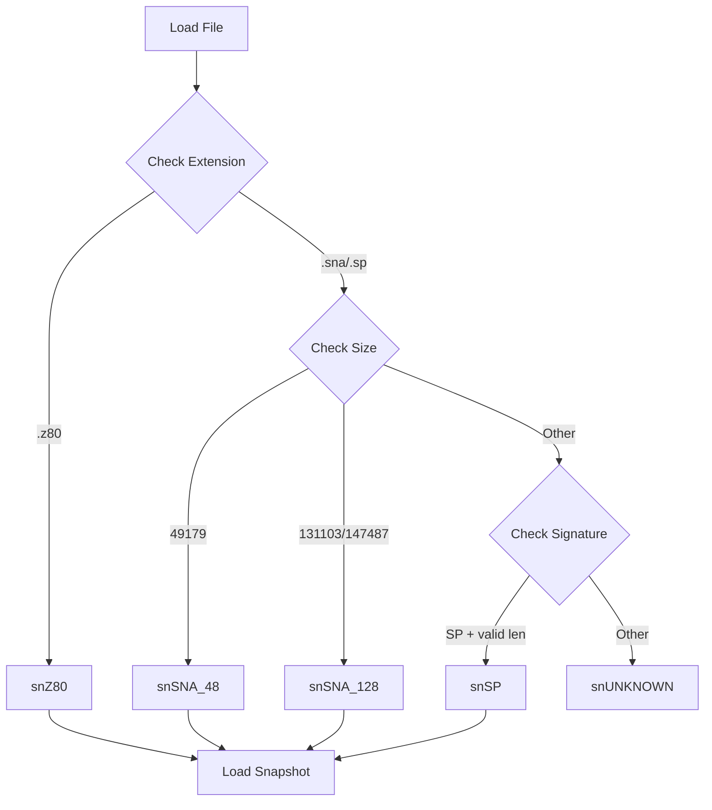
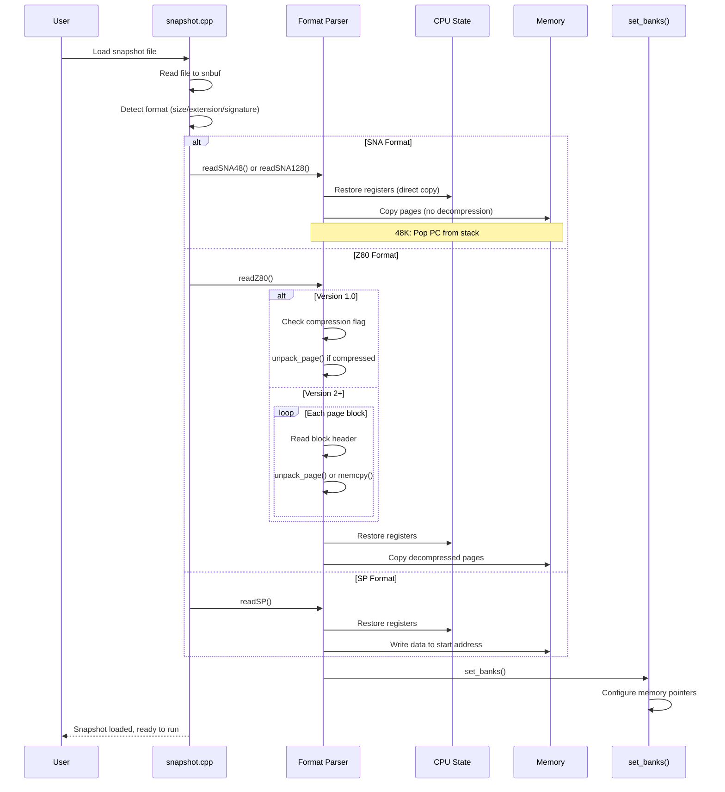

# Snapshot Loading Architecture

This document provides a comprehensive overview of the snapshot loading subsystem in UnrealSpeccy, including the SNA, Z80, and SP snapshot formats, their binary structures, loading mechanisms, and state restoration.

---

## Table of Contents

1. [Overview](#overview)
2. [Supported Snapshot Formats](#supported-snapshot-formats)
   - [SNA Format](#sna-format)
   - [Z80 Format](#z80-format)
   - [SP Format](#sp-format)
3. [Format Detection](#format-detection)
4. [Loading Pipeline](#loading-pipeline)
5. [State Restoration](#state-restoration)
6. [Compression Handling](#compression-handling)
7. [Memory Layout](#memory-layout)
8. [Saving Snapshots](#saving-snapshots)
9. [Data Flow Diagrams](#data-flow-diagrams)
10. [Source Code References](#source-code-references)

---

## Overview

Snapshot formats capture the complete state of a ZX Spectrum at a specific moment, allowing instant restoration. Unlike tape and disk loaders (which emulate I/O hardware), snapshot loaders directly restore:

- **CPU registers** — All Z80 registers including alternate set
- **Memory contents** — 48KB or 128KB RAM
- **Hardware state** — Border color, memory paging, interrupt mode

```
┌─────────────────────────────────────────────────────────────────┐
│                 Snapshot Loading Overview                       │
├─────────────────────────────────────────────────────────────────┤
│                                                                 │
│  ┌─────────────────┐                                            │
│  │  Snapshot File  │                                            │
│  │  .sna/.z80/.sp  │                                            │
│  └────────┬────────┘                                            │
│           │                                                     │
│           ▼                                                     │
│  ┌─────────────────┐                                            │
│  │ Format Detection│  (by extension + file size + signature)    │
│  └────────┬────────┘                                            │
│           │                                                     │
│           ▼                                                     │
│  ┌─────────────────┐                                            │
│  │  Format Parser  │  readSNA48() / readSNA128() /              │
│  │                 │  readZ80() / readSP()                      │
│  └────────┬────────┘                                            │
│           │                                                     │
│     ┌─────┴─────┐                                               │
│     │           │                                               │
│     ▼           ▼                                               │
│  ┌──────┐   ┌──────────┐                                        │
│  │ CPU  │   │  Memory  │                                        │
│  │ State│   │ Contents │                                        │
│  └──────┘   └──────────┘                                        │
│     │           │                                               │
│     ▼           ▼                                               │
│  ┌─────────────────┐                                            │
│  │  set_banks()    │  (Configure memory mapping)                │
│  └─────────────────┘                                            │
│           │                                                     │
│           ▼                                                     │
│  ┌─────────────────┐                                            │
│  │ Emulation Ready │  (Continue execution from restored PC)     │
│  └─────────────────┘                                            │
│                                                                 │
└─────────────────────────────────────────────────────────────────┘
```

---

## Supported Snapshot Formats

### Format Comparison

| Format | Extension | 48K | 128K | Compressed | PC Storage | Complexity |
|--------|-----------|-----|------|------------|------------|------------|
| SNA | `.sna` | ✓ | ✓ | ✗ | Stack (48K) / Header (128K) | Low |
| Z80 | `.z80` | ✓ | ✓ | ✓ (RLE) | Header | Medium |
| SP | `.sp` | ✓ | ✗ | ✗ | Header | Low |

---

## SNA Format

The SNA (SNApshot) format is the most common snapshot format for the ZX Spectrum. It exists in two variants: 48K and 128K.

### SNA File Size Detection

```
┌─────────────────────────────────────────────────────────────────┐
│                   SNA Size Detection                            │
├─────────────────────────────────────────────────────────────────┤
│                                                                 │
│  File Size        │  Variant    │  RAM Pages                    │
│  ─────────────────┼─────────────┼─────────────────────────────  │
│  49,179 bytes     │  48K SNA    │  3 pages (5, 2, 0)            │
│  131,103 bytes    │  128K SNA   │  8 pages (all)                │
│  147,487 bytes    │  128K SNA   │  8 pages + extended info      │
│                                                                 │
│  Formula:                                                       │
│  48K:  27 (header) + 49152 (3 × 16384) = 49,179 bytes           │
│  128K: 49,179 + 4 (ext header) + 5 × 16384 = 131,103 bytes      │
│                                                                 │
└─────────────────────────────────────────────────────────────────┘
```

### SNA 48K Header (27 bytes)

```
┌─────────────────────────────────────────────────────────────────┐
│                   SNA 48K Header Structure                      │
├────────┬──────┬─────────────────────────────────────────────────┤
│ Offset │ Size │ Description                                     │
├────────┼──────┼─────────────────────────────────────────────────┤
│ 0x00   │ 1    │ I register                                      │
│ 0x01   │ 2    │ HL' (alternate)                                 │
│ 0x03   │ 2    │ DE' (alternate)                                 │
│ 0x05   │ 2    │ BC' (alternate)                                 │
│ 0x07   │ 2    │ AF' (alternate)                                 │
│ 0x09   │ 2    │ HL                                              │
│ 0x0B   │ 2    │ DE                                              │
│ 0x0D   │ 2    │ BC                                              │
│ 0x0F   │ 2    │ IY                                              │
│ 0x11   │ 2    │ IX                                              │
│ 0x13   │ 1    │ IFF2 (0x00=DI, 0xFF=EI)                         │
│ 0x14   │ 1    │ R register                                      │
│ 0x15   │ 2    │ AF                                              │
│ 0x17   │ 2    │ SP                                              │
│ 0x19   │ 1    │ Interrupt mode (0, 1, or 2)                     │
│ 0x1A   │ 1    │ Border color (bits 0-2 of port 0xFE)            │
├────────┼──────┼─────────────────────────────────────────────────┤
│ 0x1B   │16384 │ Page 5 (0x4000-0x7FFF) - Screen memory          │
│ 0x401B │16384 │ Page 2 (0x8000-0xBFFF)                          │
│ 0x801B │16384 │ Page 0 (0xC000-0xFFFF) - Active page            │
└────────┴──────┴─────────────────────────────────────────────────┘

Note: PC is stored on the stack and popped during load
```

### SNA 128K Extension (4 bytes after RAM)

```
┌─────────────────────────────────────────────────────────────────┐
│                   SNA 128K Extension                            │
├────────┬──────┬─────────────────────────────────────────────────┤
│ Offset │ Size │ Description                                     │
├────────┼──────┼─────────────────────────────────────────────────┤
│ 0xC01B │ 2    │ PC (Program Counter)                            │
│ 0xC01D │ 1    │ Port 0x7FFD value (memory paging)               │
│ 0xC01E │ 1    │ TR-DOS ROM paged (0 or 1)                       │
├────────┼──────┼─────────────────────────────────────────────────┤
│ 0xC01F │16384 │ Remaining pages (5 pages, excluding 5, 2, and   │
│  ...   │ ×5   │ the page at 0xC000 as indicated by p7FFD)       │
└────────┴──────┴─────────────────────────────────────────────────┘
```

### SNA Memory Page Layout

```
┌─────────────────────────────────────────────────────────────────┐
│                 SNA 128K Memory Layout                          │
├─────────────────────────────────────────────────────────────────┤
│                                                                 │
│  Header (27 bytes)                                              │
│  ├── CPU registers                                              │
│  └── Hardware state                                             │
│                                                                 │
│  Fixed Pages (always saved in header):                          │
│  ├── Page 5 (0x4000-0x7FFF) - Screen RAM                        │
│  ├── Page 2 (0x8000-0xBFFF)                                     │
│  └── Active page at 0xC000 (determined by p7FFD bits 0-2)       │
│                                                                 │
│  128K Extension:                                                │
│  ├── PC, p7FFD, TR-DOS flag                                     │
│  └── Remaining 5 pages (bitmap excludes 5, 2, and active)       │
│                                                                 │
│  Page selection bitmap:                                         │
│  mapped = 0x24 | (1 << (p7FFD & 7))                             │
│         = 0010 0100 | (active page bit)                         │
│                                                                 │
│  Example (p7FFD = 0x00, active page = 0):                       │
│  mapped = 0010 0100 | 0000 0001 = 0010 0101                     │
│  Remaining pages: 1, 3, 4, 6, 7 (bits not set)                  │
│                                                                 │
└─────────────────────────────────────────────────────────────────┘
```

### SNA Loading Algorithm (Pseudo-Code)

```
╔═══════════════════════════════════════════════════════════════╗
║                    readSNA48() Algorithm                      ║
╚═══════════════════════════════════════════════════════════════╝

FUNCTION readSNA48():
    
    reset(RM_SOS)                    // Reset to 48K mode
    
    hdr ← parse_header(snbuf)        // Cast buffer to header struct
    
    // ══════════════════════════════════════════════════════════
    // PHASE 1: Restore CPU Registers
    // ══════════════════════════════════════════════════════════
    
    cpu.alt.af ← hdr.altaf           // Alternate register set
    cpu.alt.bc ← hdr.altbc
    cpu.alt.de ← hdr.altde
    cpu.alt.hl ← hdr.althl
    
    cpu.af ← hdr.af                  // Main register set
    cpu.bc ← hdr.bc
    cpu.de ← hdr.de
    cpu.hl ← hdr.hl
    cpu.ix ← hdr.ix
    cpu.iy ← hdr.iy
    cpu.sp ← hdr.sp
    
    cpu.i ← hdr.i                    // Interrupt registers
    cpu.r_low ← hdr.r AND 0x7F
    cpu.r_hi ← hdr.r AND 0x80
    cpu.im ← hdr.im
    cpu.iff1 ← (hdr.iff1 ≠ 0) ? 1 : 0
    
    // ══════════════════════════════════════════════════════════
    // PHASE 2: Restore Hardware State
    // ══════════════════════════════════════════════════════════
    
    comp.p7FFD ← 0x30                // Lock 48K mode
    comp.pEFF7 |= EFF7_LOCKMEM       // Prevent page switching
    comp.pFE ← hdr.pFE               // Port 0xFE (border + ear)
    comp.border_attr ← comp.pFE AND 7
    
    // ══════════════════════════════════════════════════════════
    // PHASE 3: Restore Memory Contents
    // ══════════════════════════════════════════════════════════
    
    memcpy(memory + PAGE*5, hdr.page5, PAGE)   // 0x4000-0x7FFF
    memcpy(memory + PAGE*2, hdr.page2, PAGE)   // 0x8000-0xBFFF
    memcpy(memory + PAGE*0, hdr.active_page, PAGE) // 0xC000-0xFFFF
    
    // ══════════════════════════════════════════════════════════
    // PHASE 4: Pop PC from Stack
    // ══════════════════════════════════════════════════════════
    
    // SNA 48K stores PC on the stack (RETN technique)
    cpu.pc ← read_memory(cpu.sp) + 256 * read_memory(cpu.sp + 1)
    cpu.sp ← cpu.sp + 2
    
    set_banks()                      // Apply memory configuration
    RETURN 1


╔═══════════════════════════════════════════════════════════════╗
║                   readSNA128() Algorithm                      ║
╚═══════════════════════════════════════════════════════════════╝

FUNCTION readSNA128():
    
    conf.mem_model ← MM_PENTAGON
    conf.ramsize ← 128
    
    hdr ← parse_header(snbuf)
    reset(hdr.trdos ? RM_DOS : RM_SOS)
    
    // Restore CPU registers (same as 48K)
    // ... (identical to readSNA48)
    
    cpu.pc ← hdr.pc                  // PC from extension header
    comp.p7FFD ← hdr.p7FFD           // Memory paging register
    
    // Restore fixed pages
    memcpy(memory + PAGE*5, hdr.page5, PAGE)
    memcpy(memory + PAGE*2, hdr.page2, PAGE)
    memcpy(memory + PAGE*(hdr.p7FFD AND 7), hdr.active_page, PAGE)
    
    // Restore remaining pages
    newpage ← snbuf + 0xC01F
    mapped ← 0x24 OR (1 << (hdr.p7FFD AND 7))  // Pages already saved
    
    FOR i ← 0 TO 7:
        IF NOT (mapped AND (1 << i)):
            memcpy(memory + PAGE*i, newpage, PAGE)
            newpage ← newpage + PAGE
    
    set_banks()
    RETURN 1
```

---

## Z80 Format

The Z80 format is more complex than SNA, supporting multiple versions with optional compression.

### Z80 Version Detection

```
┌─────────────────────────────────────────────────────────────────┐
│                   Z80 Version Detection                         │
├─────────────────────────────────────────────────────────────────┤
│                                                                 │
│  Check: Is PC at offset 6-7 equal to zero?                      │
│                                                                 │
│  IF header.pc ≠ 0:                                              │
│      Version 1.0 (original)                                     │
│      Header size: 30 bytes                                      │
│      48K only, optional compression                             │
│                                                                 │
│  IF header.pc == 0:                                             │
│      Extended header follows at offset 30                       │
│      Read header.len to determine version:                      │
│                                                                 │
│      len = 23: Version 2.01                                     │
│      len = 54: Version 3.0                                      │
│      len = 55: Version 3.0 with +3 support                      │
│                                                                 │
│      True PC stored at header.newpc (offset 32-33)              │
│                                                                 │
└─────────────────────────────────────────────────────────────────┘
```

### Z80 Header Structure

```cpp
// snapshot.h
struct hdrZ80
{
    // ═══════════════════════════════════════════════════════════
    // Original header (30 bytes) - All versions
    // ═══════════════════════════════════════════════════════════
    unsigned char a, f;           // 0x00-0x01: AF register
    unsigned short bc, hl;        // 0x02-0x05: BC, HL
    unsigned short pc, sp;        // 0x06-0x09: PC, SP (PC=0 in v2+)
    unsigned char i, r;           // 0x0A-0x0B: I, R (low 7 bits)
    unsigned char flags;          // 0x0C: Flags byte (see below)
    unsigned short de;            // 0x0D-0x0E: DE
    unsigned short bc1, de1, hl1; // 0x0F-0x14: BC', DE', HL'
    unsigned char a1, f1;         // 0x15-0x16: A', F'
    unsigned short iy, ix;        // 0x17-0x1A: IY, IX
    unsigned char iff1, iff2, im; // 0x1B-0x1D: IFF1, IFF2, IM

    // ═══════════════════════════════════════════════════════════
    // Version 2.01 extension (23 additional bytes)
    // ═══════════════════════════════════════════════════════════
    unsigned short len;           // 0x1E-0x1F: Extension length
    unsigned short newpc;         // 0x20-0x21: True PC value
    unsigned char model;          // 0x22: Hardware model
    unsigned char p7FFD;          // 0x23: Port 0x7FFD value
    unsigned char r1, r2;         // 0x24-0x25: Interface I state
    unsigned char p7FFD_1;        // 0x26: Last OUT to port 0xFFFD
    unsigned char AY[16];         // 0x27-0x36: AY register contents

    // ═══════════════════════════════════════════════════════════
    // Version 3.0 extension (additional bytes)
    // ═══════════════════════════════════════════════════════════
    u16 LowT;                     // 0x37-0x38: T-state counter low
    u8 HighT;                     // 0x39: T-state counter high
    u8 ReservedFlag;              // 0x3A: Reserved
    // ... more fields for +3/Pentagon
    u8 p1FFD;                     // Port 0x1FFD (Spectrum +3)
};
```

### Z80 Flags Byte (Offset 0x0C)

```
┌─────────────────────────────────────────────────────────────────┐
│                   Z80 Flags Byte (offset 12)                    │
├─────────────────────────────────────────────────────────────────┤
│                                                                 │
│  Bit 0:     R register bit 7 (R high bit)                       │
│  Bits 1-3:  Border color (0-7)                                  │
│  Bit 4:     Basic SamRom switched in (irrelevant)               │
│  Bit 5:     Data is compressed (version 1.0 only)               │
│  Bits 6-7:  Reserved                                            │
│                                                                 │
│  Special case: If flags == 0xFF, treat as 0x01                  │
│                                                                 │
│  Example:                                                       │
│  flags = 0x2D = 0010 1101                                       │
│  ├── Bit 0 = 1: R high bit set                                  │
│  ├── Bits 1-3 = 110 = 6: Border = cyan                          │
│  ├── Bit 4 = 0: SamRom not switched                             │
│  └── Bit 5 = 1: Data is compressed                              │
│                                                                 │
└─────────────────────────────────────────────────────────────────┘
```

### Z80 Hardware Model Codes

| Code | Model | RAM | Notes |
|------|-------|-----|-------|
| 0 | 48K | 48KB | Original Spectrum |
| 1 | 48K + IF1 | 48KB | With Interface 1 |
| 2 | SamRam | 48KB | With SamRam |
| 3 | 128K | 128KB | Spectrum 128K |
| 4 | 128K + IF1 | 128KB | 128K with Interface 1 |
| 5-6 | Reserved | - | - |
| 7 | +3 | 128KB | Spectrum +3 |
| 12 | +2 | 128KB | Spectrum +2 |
| 13 | +2A | 128KB | Spectrum +2A |
| 14 | Pentagon | 128KB | Pentagon clone |

### Z80 Page Block Structure (Version 2+)

```
┌─────────────────────────────────────────────────────────────────┐
│                   Z80 Page Block Header                         │
├─────────────────────────────────────────────────────────────────┤
│                                                                 │
│  ┌─────────┬──────────────────────────────────────────────────┐ │
│  │ Offset  │ Description                                      │ │
│  ├─────────┼──────────────────────────────────────────────────┤ │
│  │ 0x00-01 │ Compressed data length (0xFFFF = uncompressed)   │ │
│  │ 0x02    │ Page number (see mapping table below)            │ │
│  │ 0x03... │ Page data (compressed or raw 16384 bytes)        │ │
│  └─────────┴──────────────────────────────────────────────────┘ │
│                                                                 │
│  Page Number Mapping:                                           │
│  ┌────────┬─────────────────────┬─────────────────────────────┐ │
│  │ Number │ 48K Address         │ 128K Page                   │ │
│  ├────────┼─────────────────────┼─────────────────────────────┤ │
│  │ 0      │ 48K ROM             │ 128K ROM (SOS)              │ │
│  │ 1      │ -                   │ TR-DOS ROM                  │ │
│  │ 2      │ -                   │ 128K ROM                    │ │
│  │ 3      │ -                   │ Page 0                      │ │
│  │ 4      │ 0x8000-0xBFFF       │ Page 1                      │ │
│  │ 5      │ 0xC000-0xFFFF       │ Page 2                      │ │
│  │ 6      │ -                   │ Page 3                      │ │
│  │ 7      │ -                   │ Page 4                      │ │
│  │ 8      │ 0x4000-0x7FFF       │ Page 5                      │ │
│  │ 9      │ -                   │ Page 6                      │ │
│  │ 10     │ -                   │ Page 7                      │ │
│  │ 11     │ -                   │ Multiface ROM               │ │
│  └────────┴─────────────────────┴─────────────────────────────┘ │
│                                                                 │
└─────────────────────────────────────────────────────────────────┘
```

### Z80 Loading Algorithm (Pseudo-Code)

```
╔═══════════════════════════════════════════════════════════════╗
║                     readZ80() Algorithm                       ║
╚═══════════════════════════════════════════════════════════════╝

FUNCTION readZ80():
    
    hdr ← parse_header(snbuf)
    ptr ← snbuf + 30                 // Start after base header
    
    // Handle flags == 0xFF quirk
    IF hdr.flags == 0xFF:
        hdr.flags ← 1
    
    // ══════════════════════════════════════════════════════════
    // PHASE 1: Detect Version and Model
    // ══════════════════════════════════════════════════════════
    
    IF hdr.pc == 0:
        // Version 2+ with extension header
        ptr ← ptr + 2 + hdr.len      // Skip extension header
        hdr.pc ← hdr.newpc           // Use true PC
        model48k ← (hdr.model < 3)
        clear_memory(RAM_BASE, 8 * PAGE)
        
        // Process page blocks
        WHILE ptr < snbuf + snapsize:
            len ← read_u16(ptr)
            page_num ← ptr[2]
            ptr ← ptr + 3
            
            IF page_num > 11:
                RETURN 0             // Invalid page number
            
            dst ← get_page_address(page_num, model48k)
            IF dst == NULL:
                RETURN 0             // Invalid page mapping
            
            IF len == 0xFFFF:
                // Uncompressed page
                memcpy(dst, ptr, PAGE)
                len ← PAGE
            ELSE:
                // Compressed page (RLE)
                unpack_page(dst, PAGE, ptr, len)
            
            ptr ← ptr + len
    ELSE:
        // Version 1.0 (48K only)
        model48k ← TRUE
        len ← snapsize - 30
        
        IF hdr.flags AND 0x20:
            // Compressed data
            unpack_page(temp_buffer, 3 * PAGE, ptr, len)
            mem48 ← temp_buffer
        ELSE:
            mem48 ← ptr
        
        // Copy to memory locations
        memcpy(memory + PAGE*5, mem48, PAGE)          // 0x4000
        memcpy(memory + PAGE*2, mem48 + PAGE, PAGE)   // 0x8000
        memcpy(memory + PAGE*0, mem48 + 2*PAGE, PAGE) // 0xC000
    
    // ══════════════════════════════════════════════════════════
    // PHASE 2: Restore CPU State
    // ══════════════════════════════════════════════════════════
    
    cpu.a ← hdr.a
    cpu.f ← hdr.f
    cpu.bc ← hdr.bc
    cpu.de ← hdr.de
    cpu.hl ← hdr.hl
    cpu.alt.bc ← hdr.bc1
    cpu.alt.de ← hdr.de1
    cpu.alt.hl ← hdr.hl1
    cpu.alt.a ← hdr.a1
    cpu.alt.f ← hdr.f1
    cpu.pc ← hdr.pc
    cpu.sp ← hdr.sp
    cpu.ix ← hdr.ix
    cpu.iy ← hdr.iy
    cpu.i ← hdr.i
    cpu.r_low ← hdr.r AND 0x7F
    cpu.r_hi ← (hdr.flags AND 1) << 7
    cpu.iff1 ← hdr.iff1
    cpu.iff2 ← hdr.iff2
    cpu.im ← hdr.im AND 3
    
    // ══════════════════════════════════════════════════════════
    // PHASE 3: Restore Hardware State
    // ══════════════════════════════════════════════════════════
    
    comp.pFE ← (hdr.flags >> 1) AND 7    // Border from flags
    comp.border_attr ← comp.pFE
    comp.p7FFD ← model48k ? 0x30 : hdr.p7FFD
    
    IF hdr.len == 55:                    // Version 3.0
        comp.p1FFD ← hdr.p1FFD
    
    IF model48k:
        comp.pEFF7 |= EFF7_LOCKMEM
    
    set_banks()
    RETURN 1
```

---

## SP Format

The SP (Spectrum) format is a simple 48K-only snapshot format.

### SP Header Structure (38 bytes)

```
┌─────────────────────────────────────────────────────────────────┐
│                   SP Header Structure                           │
├────────┬──────┬─────────────────────────────────────────────────┤
│ Offset │ Size │ Description                                     │
├────────┼──────┼─────────────────────────────────────────────────┤
│ 0x00   │ 2    │ Signature "SP" (0x53, 0x50)                     │
│ 0x02   │ 2    │ Length of data block                            │
│ 0x04   │ 2    │ Start address of data                           │
│ 0x06   │ 2    │ BC register                                     │
│ 0x08   │ 2    │ DE register                                     │
│ 0x0A   │ 2    │ HL register                                     │
│ 0x0C   │ 2    │ AF register                                     │
│ 0x0E   │ 2    │ IX register                                     │
│ 0x10   │ 2    │ IY register                                     │
│ 0x12   │ 2    │ BC' (alternate)                                 │
│ 0x14   │ 2    │ DE' (alternate)                                 │
│ 0x16   │ 2    │ HL' (alternate)                                 │
│ 0x18   │ 2    │ AF' (alternate)                                 │
│ 0x1A   │ 1    │ R register                                      │
│ 0x1B   │ 1    │ I register                                      │
│ 0x1C   │ 2    │ SP register                                     │
│ 0x1E   │ 2    │ PC register                                     │
│ 0x20   │ 2    │ Reserved                                        │
│ 0x22   │ 1    │ Border color (port 0xFE)                        │
│ 0x23   │ 1    │ Reserved                                        │
│ 0x24   │ 2    │ Flags (bit 0=IFF1, bit 1=IM mode, bit 2=IFF2)   │
├────────┼──────┼─────────────────────────────────────────────────┤
│ 0x26   │ len  │ Data block (written to 'start' address)         │
└────────┴──────┴─────────────────────────────────────────────────┘

Validation: File size must equal 0x26 + len
```

### SP Flags Word

```
┌─────────────────────────────────────────────────────────────────┐
│                   SP Flags Word (offset 0x24)                   │
├─────────────────────────────────────────────────────────────────┤
│                                                                 │
│  Bit 0:  IFF1 (Interrupt Flip-Flop 1)                           │
│  Bit 1:  IM mode deviation (0=IM1, 1=IM2)                       │
│  Bit 2:  IFF2 (Interrupt Flip-Flop 2)                           │
│  Bits 3-15: Reserved                                            │
│                                                                 │
│  IM calculation: im = 1 + ((flags >> 1) & 1)                    │
│                                                                 │
│  Examples:                                                      │
│  flags = 0x0001 → IFF1=1, IM=1, IFF2=0                          │
│  flags = 0x0007 → IFF1=1, IM=2, IFF2=1                          │
│                                                                 │
└─────────────────────────────────────────────────────────────────┘
```

### SP Loading Algorithm (Pseudo-Code)

```
╔═══════════════════════════════════════════════════════════════╗
║                     readSP() Algorithm                        ║
╚═══════════════════════════════════════════════════════════════╝

FUNCTION readSP():
    
    reset(RM_SOS)                    // 48K mode
    
    hdr ← parse_header(snbuf)
    
    // Restore CPU registers
    cpu.alt.af ← hdr.altaf
    cpu.alt.bc ← hdr.altbc
    cpu.alt.de ← hdr.altde
    cpu.alt.hl ← hdr.althl
    
    cpu.af ← hdr.af
    cpu.bc ← hdr.bc
    cpu.de ← hdr.de
    cpu.hl ← hdr.hl
    cpu.ix ← hdr.ix
    cpu.iy ← hdr.iy
    cpu.sp ← hdr.sp
    cpu.pc ← hdr.pc                  // PC from header
    
    cpu.i ← hdr.i
    cpu.r_low ← hdr.r AND 0x7F
    cpu.r_hi ← hdr.r AND 0x80
    
    cpu.iff1 ← hdr.flags AND 1
    cpu.im ← 1 + ((hdr.flags >> 1) AND 1)
    cpu.iff2 ← (hdr.flags >> 2) AND 1
    
    // Hardware state
    comp.p7FFD ← 0x30
    comp.pEFF7 |= EFF7_LOCKMEM
    comp.pFE ← hdr.pFE
    comp.border_attr ← comp.pFE AND 7
    
    // Copy data to specified address
    FOR i ← 0 TO hdr.len - 1:
        write_memory(hdr.start + i, snbuf[0x26 + i])
    
    set_banks()
    RETURN 1
```

---

## Format Detection

UnrealSpeccy detects snapshot format by file extension, size, and content signatures:

```cpp
// snapshot.cpp - Format detection
unsigned char type = snUNKNOWN;

// SNA detection by exact file size
if (snapsize == 131103 || snapsize == 147487) 
    type = snSNA_128;
if (snapsize == 49179) 
    type = snSNA_48;

// Z80 detection by extension
if (ext == WORD4('z','8','0',' ')) 
    type = snZ80;

// SP detection by signature + size
if (*(unsigned short*)snbuf == WORD2('S','P') && 
    *(unsigned short*)(snbuf+2) + 0x26 == (int)snapsize) 
    type = snSP;
```

### Detection Priority



---

## Compression Handling

### Z80 RLE Compression

The Z80 format uses a simple Run-Length Encoding scheme:

```
┌─────────────────────────────────────────────────────────────────┐
│                   Z80 RLE Compression                           │
├─────────────────────────────────────────────────────────────────┤
│                                                                 │
│  Escape sequence: ED ED count byte                              │
│                                                                 │
│  Reading:                                                       │
│  ├── If next 2 bytes are ED ED:                                 │
│  │   ├── Read count (3rd byte)                                  │
│  │   ├── Read value (4th byte)                                  │
│  │   └── Output 'value' repeated 'count' times                  │
│  └── Otherwise:                                                 │
│      └── Output byte literally                                  │
│                                                                 │
│  Example:                                                       │
│  Compressed:   41 42 ED ED 05 00 43                             │
│  Decompressed: 41 42 00 00 00 00 00 43                          │
│                                                                 │
│  Note: ED ED sequence cannot appear in compressed data          │
│        (would be encoded as ED ED 02 ED)                        │
│                                                                 │
└─────────────────────────────────────────────────────────────────┘
```

### Decompression Implementation

```cpp
// snapshot.cpp
void unpack_page(unsigned char *dst, int dstlen, 
                 unsigned char *src, int srclen)
{
    memset(dst, 0, dstlen);
    
    while (srclen > 0 && dstlen > 0) {
        // Check for ED ED escape sequence
        if (srclen >= 4 && 
            *(unsigned short*)src == WORD2(0xED, 0xED)) {
            // RLE: repeat src[3] for src[2] times
            for (unsigned char i = src[2]; i; i--)
                *dst++ = src[3], dstlen--;
            srclen -= 4; 
            src += 4;
        } else {
            // Literal byte
            *dst++ = *src++;
            dstlen--;
            srclen--;
        }
    }
}
```

---

## Memory Layout

### Spectrum Memory Architecture

```
┌─────────────────────────────────────────────────────────────────┐
│              ZX Spectrum Memory Layout                          │
├─────────────────────────────────────────────────────────────────┤
│                                                                 │
│  48K Spectrum:                                                  │
│  ┌────────────────────────────────────────────────────────────┐ │
│  │ 0x0000-0x3FFF │ ROM (16KB)                                 │ │
│  │ 0x4000-0x7FFF │ RAM Page 5 (Screen + attributes)          │ │
│  │ 0x8000-0xBFFF │ RAM Page 2                                 │ │
│  │ 0xC000-0xFFFF │ RAM Page 0                                 │ │
│  └────────────────────────────────────────────────────────────┘ │
│                                                                 │
│  128K Spectrum:                                                 │
│  ┌────────────────────────────────────────────────────────────┐ │
│  │ 0x0000-0x3FFF │ ROM (bank 0-3, selected by p7FFD/p1FFD)   │ │
│  │ 0x4000-0x7FFF │ RAM Page 5 (always)                       │ │
│  │ 0x8000-0xBFFF │ RAM Page 2 (always)                       │ │
│  │ 0xC000-0xFFFF │ RAM Page 0-7 (selected by p7FFD bits 0-2) │ │
│  └────────────────────────────────────────────────────────────┘ │
│                                                                 │
│  RAM Pages:                                                     │
│  ┌──────┬────────────────────────────────────────────────────┐  │
│  │ Page │ Description                                        │  │
│  ├──────┼────────────────────────────────────────────────────┤  │
│  │ 0    │ General purpose                                    │  │
│  │ 1    │ General purpose                                    │  │
│  │ 2    │ Mapped at 0x8000-0xBFFF                            │  │
│  │ 3    │ General purpose                                    │  │
│  │ 4    │ General purpose                                    │  │
│  │ 5    │ Screen RAM at 0x4000-0x7FFF                        │  │
│  │ 6    │ General purpose                                    │  │
│  │ 7    │ Shadow screen (128K)                               │  │
│  └──────┴────────────────────────────────────────────────────┘  │
│                                                                 │
└─────────────────────────────────────────────────────────────────┘
```

### Port 0x7FFD (128K Paging)

```
┌─────────────────────────────────────────────────────────────────┐
│                   Port 0x7FFD Bits                              │
├─────────────────────────────────────────────────────────────────┤
│                                                                 │
│  Bit 0-2: RAM page at 0xC000-0xFFFF (0-7)                       │
│  Bit 3:   Screen page (0=page 5, 1=page 7 shadow)               │
│  Bit 4:   ROM select (0=128K ROM, 1=48K ROM)                    │
│  Bit 5:   Paging disable (1=locked, cannot change)              │
│  Bit 6-7: Unused                                                │
│                                                                 │
│  48K lock value: p7FFD = 0x30 (bit 4 + bit 5 set)               │
│                                                                 │
└─────────────────────────────────────────────────────────────────┘
```

---

## Saving Snapshots

### SNA Save Implementation

```cpp
// snapshot.cpp - writeSNA()
int writeSNA(FILE *ff)
{
    hdrSNA128 *hdr = (hdrSNA128*)snbuf;
    
    // Set TR-DOS flag
    hdr->trdos = (comp.flags & CF_TRDOS) ? 1 : 0;
    
    // Save CPU registers
    hdr->altaf = cpu.alt.af; hdr->altbc = cpu.alt.bc;
    hdr->altde = cpu.alt.de; hdr->althl = cpu.alt.hl;
    hdr->af = cpu.af; hdr->bc = cpu.bc; 
    hdr->de = cpu.de; hdr->hl = cpu.hl;
    hdr->ix = cpu.ix; hdr->iy = cpu.iy; 
    hdr->sp = cpu.sp; hdr->pc = cpu.pc;
    hdr->i = cpu.i; 
    hdr->r = (cpu.r_low & 0x7F) + cpu.r_hi;
    hdr->im = cpu.im;
    hdr->iff1 = cpu.iff1 ? 0xFF : 0;
    hdr->p7FFD = comp.p7FFD;
    hdr->pFE = comp.pFE;
    
    // Determine 48K or 128K mode
    unsigned char mapped = 0x24 | (1 << (comp.p7FFD & 7));
    unsigned savesize;
    
    if (comp.p7FFD == 0x30) {
        // 48K mode: Push PC to stack
        mapped = 0xFF;
        savesize = 0xC01B;
        hdr->sp -= 2;
        cpu.DirectWm(hdr->sp, cpu.pcl);
        cpu.DirectWm(hdr->sp+1, cpu.pch);
    } else {
        savesize = sizeof(hdrSNA128);
    }
    
    // Copy memory pages to header
    memcpy(hdr->page5, memory + PAGE*5, PAGE);
    memcpy(hdr->page2, memory + PAGE*2, PAGE);
    memcpy(hdr->active_page, memory + PAGE*(comp.p7FFD & 7), PAGE);
    
    // Write header and fixed pages
    if (fwrite(hdr, 1, savesize, ff) != savesize) 
        return 0;
    
    // Write remaining 128K pages
    for (unsigned char i = 0; i < 8; i++)
        if (!(mapped & (1 << i)))
            if (fwrite(memory + PAGE*i, 1, PAGE, ff) != PAGE) 
                return 0;
    
    return 1;
}
```

---

## Data Flow Diagrams

### Complete Snapshot Loading Flow



### State Restoration Detail

```mermaid
flowchart TB
    subgraph Input ["Snapshot File"]
        FILE[Binary File]
    end
    
    subgraph Parse ["Parsing"]
        HDR[Parse Header]
        DECOMP[Decompress if needed]
    end
    
    subgraph Restore ["State Restoration"]
        subgraph CPU_State ["CPU State"]
            REG[Main Registers<br/>A,F,BC,DE,HL,SP,PC]
            ALT[Alternate Registers<br/>A',F',BC',DE',HL']
            INT[Interrupt State<br/>I,R,IFF1,IFF2,IM]
        end
        
        subgraph HW_State ["Hardware State"]
            BORDER[Border Color<br/>pFE bits 0-2]
            PAGING[Memory Paging<br/>p7FFD, p1FFD]
        end
        
        subgraph MEM_State ["Memory State"]
            PAGE5[Page 5<br/>Screen RAM]
            PAGE2[Page 2]
            PAGEX[Active Page<br/>at 0xC000]
            OTHER[Other Pages<br/>128K only]
        end
    end
    
    subgraph Final ["Finalization"]
        BANKS[set_banks()]
        READY[Resume Execution]
    end
    
    FILE --> HDR
    HDR --> DECOMP
    
    DECOMP --> REG
    DECOMP --> ALT
    DECOMP --> INT
    DECOMP --> BORDER
    DECOMP --> PAGING
    DECOMP --> PAGE5
    DECOMP --> PAGE2
    DECOMP --> PAGEX
    DECOMP --> OTHER
    
    REG --> BANKS
    ALT --> BANKS
    INT --> BANKS
    BORDER --> BANKS
    PAGING --> BANKS
    PAGE5 --> BANKS
    PAGE2 --> BANKS
    PAGEX --> BANKS
    OTHER --> BANKS
    
    BANKS --> READY
```

---

## Source Code References

### Core Files

| File | Description |
|------|-------------|
| [snapshot.cpp](file:///Users/dev/Projects/GitHub/unrealspeccy/snapshot.cpp) | All snapshot loading/saving logic |
| [snapshot.h](file:///Users/dev/Projects/GitHub/unrealspeccy/snapshot.h) | Header structures (hdrSNA128, hdrZ80, hdrSP) |

### Key Functions

| Function | Purpose |
|----------|---------|
| `loadsnap()` | Main entry point, format detection |
| `readSNA48()` | Load 48K SNA snapshots |
| `readSNA128()` | Load 128K SNA snapshots |
| `readZ80()` | Load Z80 snapshots (all versions) |
| `readSP()` | Load SP snapshots |
| `writeSNA()` | Save SNA snapshots |
| `unpack_page()` | Z80 RLE decompression |

---

## Comparison: Snapshot vs Tape/Disk Loading

```
┌─────────────────────────────────────────────────────────────────┐
│        Snapshot vs Tape/Disk Loading Comparison                 │
├────────────────────┬────────────────────────────────────────────┤
│     Aspect         │  Snapshot        │  Tape/Disk              │
├────────────────────┼──────────────────┼─────────────────────────┤
│ Load time          │ Instant          │ Seconds to minutes      │
│ Accuracy           │ Exact state      │ Program-dependent       │
│ Hardware emulation │ None needed      │ Full I/O emulation      │
│ File size          │ Fixed/predictable│ Variable                │
│ 128K support       │ Format-dependent │ Program-dependent       │
│ Compression        │ Z80 only (RLE)   │ None                    │
│ Interruptibility   │ No               │ Yes (can stop loading)  │
│ Saving             │ SNA only         │ Disk formats only       │
│ Use case           │ Quick restore    │ Authenticity            │
└────────────────────┴──────────────────┴─────────────────────────┘
```
