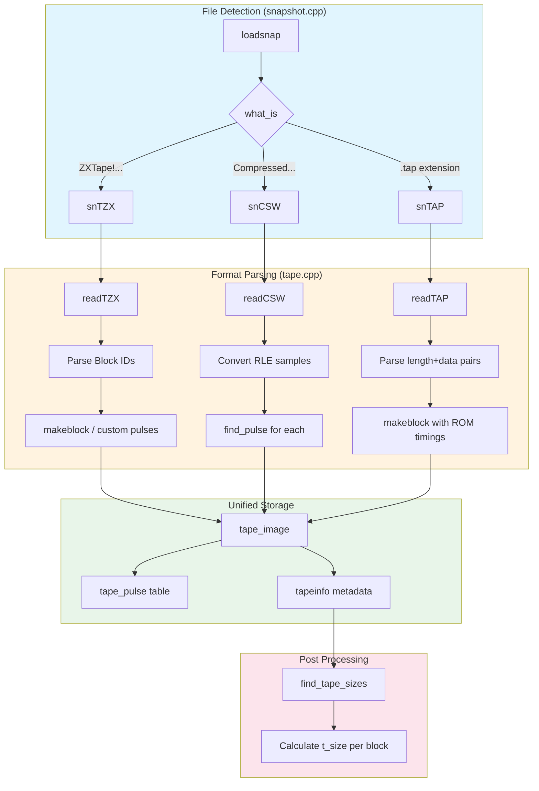
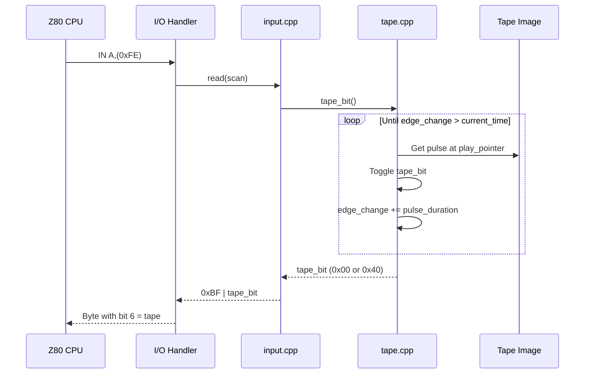
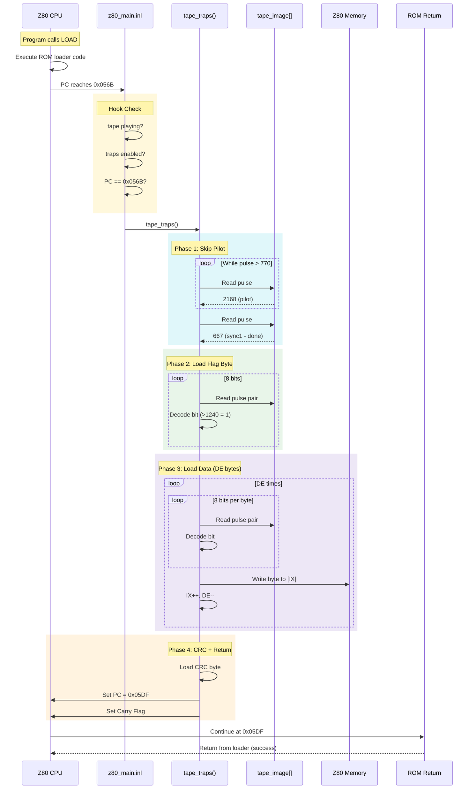
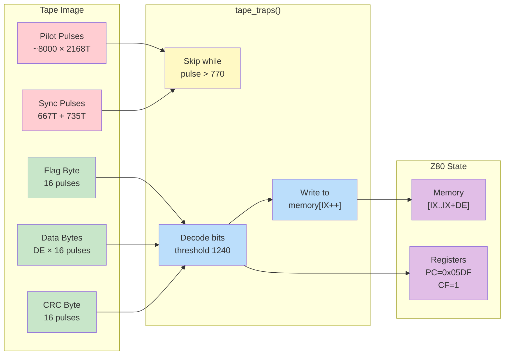
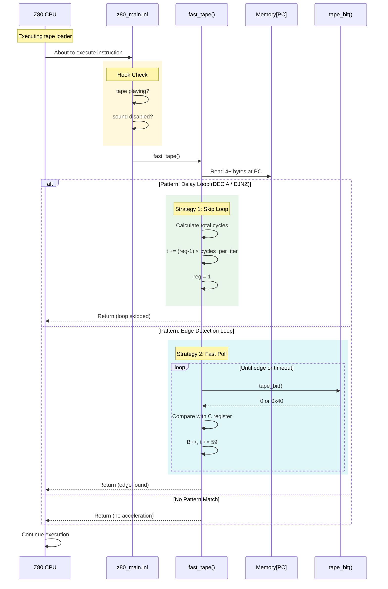
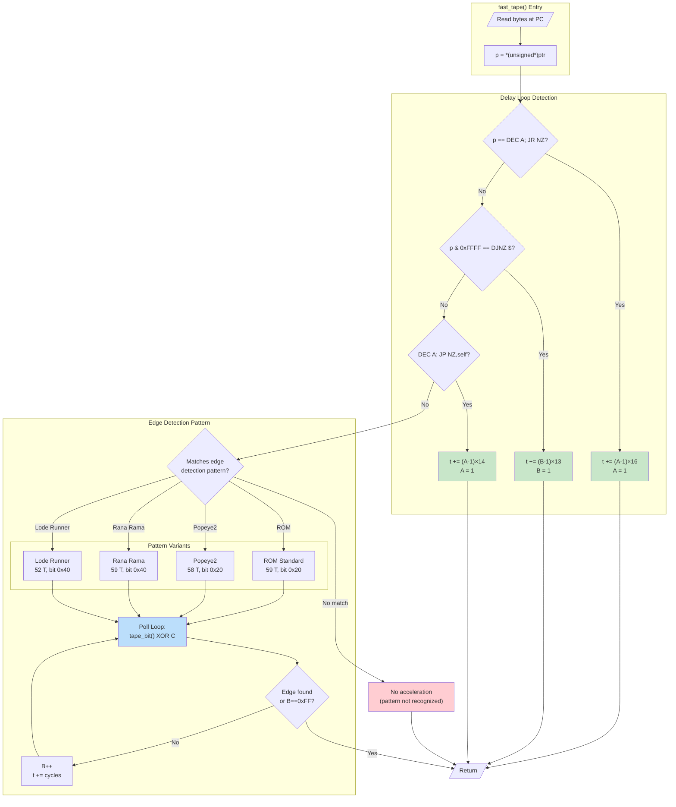
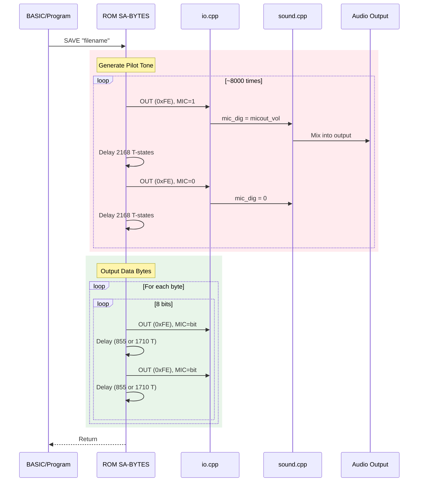
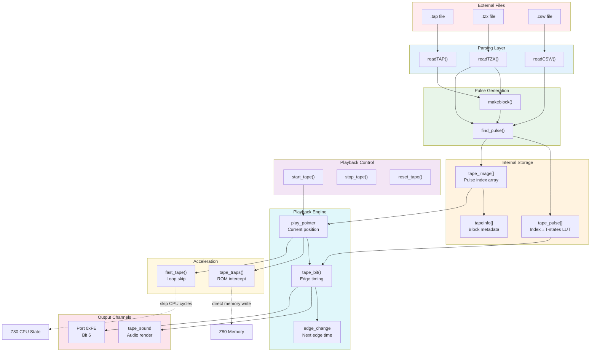
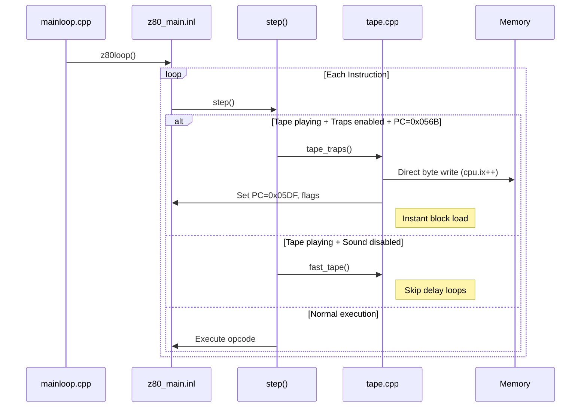

# Tape Loading Architecture

> **UnrealSpeccy Tape Subsystem** - Complete technical documentation of tape file loading,
> playback mechanisms, and turbo acceleration features.

## Table of Contents

1. [Overview](#overview)
2. [Supported Tape Formats](#supported-tape-formats)
   - [TAP Format](#tap-format)
   - [TZX Format](#tzx-format)
   - [CSW Format](#csw-format)
3. [Internal Representation](#internal-representation)
4. [Loading Pipeline](#loading-pipeline)
5. [Tape Playback System](#tape-playback-system)
6. [Turbo Mode Acceleration](#turbo-mode-acceleration)
7. [Data Flow Diagrams](#data-flow-diagrams)
8. [Timing Constants](#timing-constants)

---

## Overview

The tape loading system in UnrealSpeccy converts various tape image formats into a unified
internal pulse representation, then plays back these pulses in sync with the emulated Z80 CPU.
The system supports three acceleration modes for faster loading.

### Key Components

| File | Purpose |
|------|---------|
| `tape.cpp` | Core tape logic - format parsers, pulse generation, playback |
| `tape.h` | Tape interface declarations |
| `snapshot.cpp` | File type detection and loading dispatch |
| `input.cpp` | Tape bit integration with keyboard port (0xFE) |
| `sound.cpp` | Tape audio output |
| `z80_main.inl` | Z80 execution loop with tape hooks |

---

## Supported Tape Formats

### TAP Format

TAP is the simplest tape format - a sequence of data blocks with standard Spectrum timings.

```
┌──────────────────────────────────────────────────────────┐
│                    TAP File Structure                    │
├──────────────────────────────────────────────────────────┤
│  Block 1  │  Block 2  │  Block 3  │  ...  │  Block N     │
└──────────────────────────────────────────────────────────┘

Each Block:
┌────────────────┬─────────────────────────────────────────────┐
│  Size (2 bytes)│            Data (Size bytes)                │
│   little-endian│  First byte = flag (0x00=header, 0xFF=data) │
└────────────────┴─────────────────────────────────────────────┘
```

**Implementation** (`readTAP()` - line 175-189):
```cpp
int readTAP() {
    unsigned char *ptr = snbuf; 
    closetape();
    while (ptr < snbuf+snapsize) {
        unsigned size = *(unsigned short*)ptr; 
        ptr += 2;
        if (!size) break;
        
        alloc_infocell();
        desc(ptr, size, tapeinfo[tape_infosize].desc);
        tape_infosize++;
        
        // Generate pulses with standard Spectrum timings
        makeblock(ptr, size, 
            2168,   // pilot pulse T-states
            667,    // sync1 pulse
            735,    // sync2 pulse  
            855,    // zero bit pulse
            1710,   // one bit pulse
            (*ptr < 4) ? 8064 : 3220,  // pilot length (header vs data)
            1000);  // pause in ms
        ptr += size;
    }
    find_tape_sizes();
    return (ptr == snbuf+snapsize);
}
```

**Standard TAP Timings** (in Z80 T-states @ 3.5MHz):

| Pulse Type | T-States | Duration (μs) |
|------------|----------|---------------|
| Pilot | 2168 | 619 |
| Sync 1 | 667 | 191 |
| Sync 2 | 735 | 210 |
| Zero Bit | 855 × 2 | 489 |
| One Bit | 1710 × 2 | 977 |
| Header Pilot Length | 8064 pulses | ~5 sec |
| Data Pilot Length | 3220 pulses | ~2 sec |

---

### TZX Format

TZX is a comprehensive format supporting turbo loaders, direct recordings, and metadata.

```
┌──────────────────────────────────────────────────────────┐
│                    TZX File Structure                    │
├──────────────────────────────────────────────────────────┤
│  Header (10 bytes)  │  Block 1  │  Block 2  │  ...       │
│  "ZXTape!" + 0x1A   │  ID+Data  │  ID+Data  │            │
│  + Major + Minor    │           │           │            │
└──────────────────────────────────────────────────────────┘
```

**Supported Block Types** (`readTZX()` - line 390-624):

| Block ID | Name | Description |
|----------|------|-------------|
| 0x10 | Standard Speed | Normal ROM timing blocks |
| 0x11 | Turbo Speed | Custom timing parameters |
| 0x12 | Pure Tone | Single frequency pulse sequence |
| 0x13 | Pulse Sequence | Variable length pulses |
| 0x14 | Pure Data | Data with custom timings, no pilot |
| 0x15 | Direct Recording | Raw sample data |
| 0x20 | Pause/Stop | Silence or stop tape command |
| 0x21 | Group Start | Block grouping for organization |
| 0x22 | Group End | End of block group |
| 0x23 | Jump | Jump to relative block |
| 0x24 | Loop Start | Begin loop |
| 0x25 | Loop End | End loop |
| 0x26 | Call Sequence | Call subroutine blocks |
| 0x27 | Return | Return from call |
| 0x28 | Select Block | User selection menu |
| 0x2A | Stop if 48K | Conditional stop |
| 0x30 | Text Description | Metadata |
| 0x31 | Message Block | Display message |
| 0x32 | Archive Info | Title, author, etc. |
| 0x33 | Hardware Type | Compatibility info |
| 0x34 | Emulation Info | Emulator hints |
| 0x35 | Custom Info | Custom data (POKEs) |
| 0x40 | Snapshot | Embedded snapshot |
| 0x5A | Glue | Merge multiple TZX files |

**Turbo Block (0x11) Structure**:
```cpp
// Block 0x11 - Turbo Speed Data
struct TurboBlock {
    uint16_t pilot_pulse;    // offset 0x00
    uint16_t sync1_pulse;    // offset 0x02
    uint16_t sync2_pulse;    // offset 0x04
    uint16_t zero_pulse;     // offset 0x06
    uint16_t one_pulse;      // offset 0x08
    uint16_t pilot_length;   // offset 0x0A
    uint8_t  used_bits;      // offset 0x0C (bits in last byte)
    uint16_t pause;          // offset 0x0D
    uint24_t data_length;    // offset 0x0F
    uint8_t  data[];         // offset 0x12
};
```

**Direct Recording (0x15) Processing**:
```cpp
// Direct recording - raw bit samples
case 0x15:
    size = 0xFFFFFF & *(unsigned*)(ptr+5);
    t0 = *(unsigned short*)ptr;    // sample period
    pause = *(unsigned short*)(ptr+2);
    last = ptr[4];                  // used bits in last byte
    
    // Convert samples to pulses by detecting edges
    for (i = 0; i < size; i++)
        for (j = 0x80; j; j >>= 1)
            if ((ptr[i] ^ pl) & j) n++, pl ^= -1;  // edge detected
```

---

### CSW Format

CSW (Compressed Square Wave) stores run-length encoded pulse samples.

```
┌──────────────────────────────────────────────────────────┐
│                    CSW File Structure                    │
├──────────────────────────────────────────────────────────┤
│  Header (0x20 bytes)                                     │
│  - Signature: "Compressed Square Wave" + 0x1A            │
│  - Sample Rate (offset 0x19, 2 bytes)                    │
│  - Compression Type (offset 0x1B, 1=RLE)                 │
│  - Initial Polarity (offset 0x1C, bit 0)                 │
├──────────────────────────────────────────────────────────┤
│  RLE Data                                                │
│  - Single byte: pulse length in samples                  │
│  - 0x00 + 4 bytes: extended length (little-endian)       │
└──────────────────────────────────────────────────────────┘
```

**Implementation** (`readCSW()` - line 191-216):
```cpp
int readCSW() {
    closetape();
    named_cell("CSW tape image");
    
    if (snbuf[0x1B] != 1) return 0;  // only RLE compression supported
    
    // Convert sample rate to T-states
    unsigned rate = Z80FQ / *(unsigned short*)(snbuf + 0x19);
    if (!rate) return 0;
    
    reserve(snapsize - 0x18);
    
    // Handle initial polarity
    if (!(snbuf[0x1C] & 1))
        tape_image[tape_imagesize++] = find_pulse(1);
    
    // Decode RLE pulses
    for (unsigned char *ptr = snbuf + 0x20; ptr < snbuf + snapsize; ) {
        unsigned len = *ptr++ * rate;
        if (!len) {  // Extended length
            len = *(unsigned*)ptr * rate;
            ptr += 4;
        }
        tape_image[tape_imagesize++] = find_pulse(len);
    }
    
    tape_image[tape_imagesize++] = find_pulse(Z80FQ/10);  // final pause
    find_tape_sizes();
    return 1;
}
```

---

## Internal Representation

All tape formats are converted to a unified pulse-based representation.

### Pulse Table

```cpp
unsigned tape_pulse[0x100];   // Lookup table: index -> T-states duration
unsigned max_pulses = 0;       // Number of unique pulse lengths
```

The tape image stores pulse **indices** (0-255), not durations. This compression
allows the same pulse duration to be reused efficiently.

```cpp
unsigned find_pulse(unsigned t) {
    // Search for existing pulse
    for (unsigned i = 0; i < max_pulses; i++)
        if (tape_pulse[i] == t) return i;
    
    // Add new pulse (if table not full)
    if (max_pulses < 0x100) {
        tape_pulse[max_pulses] = t;
        return max_pulses++;
    }
    
    // Table full - find nearest match
    unsigned nearest = 0; 
    int delta = 0x7FFFFFFF;
    for (unsigned i = 0; i < 0x100; i++) {
        if (delta > abs((int)t - (int)tape_pulse[i])) {
            nearest = i;
            delta = abs((int)t - (int)tape_pulse[i]);
        }
    }
    return nearest;
}
```

### Tape Image Structure

```cpp
unsigned char *tape_image = 0;     // Array of pulse indices
unsigned tape_imagesize = 0;        // Total pulses in image

struct TAPEINFO {
    char desc[280];    // Block description
    unsigned pos;      // Offset in tape_image
    unsigned t_size;   // Total T-states for block
};

TAPEINFO *tapeinfo;                 // Block metadata array
unsigned tape_infosize;             // Number of blocks
```

### Block Generation (`makeblock()`)

```cpp
void makeblock(
    unsigned char *data, unsigned size,
    unsigned pilot_t,    // Pilot pulse duration
    unsigned s1_t,       // Sync 1 duration
    unsigned s2_t,       // Sync 2 duration
    unsigned zero_t,     // Zero bit half-pulse
    unsigned one_t,      // One bit half-pulse
    unsigned pilot_len,  // Number of pilot pulses
    unsigned pause,      // Post-block pause (ms)
    unsigned char last   // Bits used in last byte
) {
    reserve(size*16 + pilot_len + 3);
    
    // Generate pilot tone
    if (pilot_len != -1) {
        unsigned t = find_pulse(pilot_t);
        for (unsigned i = 0; i < pilot_len; i++)
            tape_image[tape_imagesize++] = t;
        tape_image[tape_imagesize++] = find_pulse(s1_t);
        tape_image[tape_imagesize++] = find_pulse(s2_t);
    }
    
    // Generate data pulses (2 pulses per bit)
    unsigned t0 = find_pulse(zero_t), t1 = find_pulse(one_t);
    for (; size > 1; size--, data++)
        for (unsigned char j = 0x80; j; j >>= 1)
            tape_image[tape_imagesize++] = (*data & j) ? t1 : t0,
            tape_image[tape_imagesize++] = (*data & j) ? t1 : t0;
    
    // Last byte (may have fewer bits)
    for (unsigned char j = 0x80; j != (unsigned char)(0x80 >> last); j >>= 1)
        tape_image[tape_imagesize++] = (*data & j) ? t1 : t0,
        tape_image[tape_imagesize++] = (*data & j) ? t1 : t0;
    
    // Post-block pause
    if (pause) 
        tape_image[tape_imagesize++] = find_pulse(pause * 3500);
}
```

---

## Loading Pipeline



---

## Tape Playback System

### Playback State (in `COMPUTER` struct)

```cpp
struct {
    __int64 edge_change;         // T-state of next signal edge
    unsigned char *play_pointer; // Current position (NULL if stopped)
    unsigned char *end_of_tape;  // End marker
    unsigned index;              // Current block index
    unsigned tape_bit;           // Current signal state (0 or -1)
} tape;
```

### Core Playback Function

```cpp
unsigned char tape_bit() {
    __int64 cur = comp.t_states + cpu.t;
    
    // Return cached bit if not yet time for next edge
    if (cur < comp.tape.edge_change)
        return (unsigned char)comp.tape.tape_bit;
    
    // Process all edges up to current time
    while (comp.tape.edge_change < cur) {
        // Update tape sound (if not blocked)
        if (!temp.sndblock) {
            unsigned t = (unsigned)(comp.tape.edge_change - 
                         comp.t_states - temp.cpu_t_at_frame_start);
            if ((int)t >= 0) {
                unsigned tape_in = conf.sound.micin_vol & comp.tape.tape_bit;
                comp.tape_sound.update(t, tape_in, tape_in);
            }
        }
        
        // Toggle signal and advance
        comp.tape.tape_bit ^= -1;  // Toggle between 0 and 0xFFFFFFFF
        
        // Get next pulse
        if (comp.tape.play_pointer == comp.tape.end_of_tape ||
            (pulse = tape_pulse[*comp.tape.play_pointer++]) == -1) {
            stop_tape();
        } else {
            comp.tape.edge_change += pulse;
        }
    }
    
    return (unsigned char)comp.tape.tape_bit;
}
```

### Port 0xFE Integration

The tape signal is read through keyboard port 0xFE, bit 6:

```cpp
// input.cpp line 394-396
unsigned char K_INPUT::read(unsigned char scan) {
    unsigned char res = 0xBF | (tape_bit() & 0x40);  // Bit 6 = tape input
    // ... keyboard matrix processing
    return res;
}
```



---

## Turbo Mode Acceleration

UnrealSpeccy provides three levels of tape loading acceleration:

### 1. Standard Playback (Real-time)

When `conf.sound.enabled = true` and no traps active:
- Pulses played at actual Z80 speed
- Loading time: **~3-5 minutes** for 48K game
- Full audio output

### 2. Tape Traps (`tape_traps()`)

ROM routine interception for instant data transfer. This is the fastest loading method, bypassing the entire Z80 edge-detection loop.

#### Hooking Mechanism Explained

The ZX Spectrum ROM contains a standard tape loading routine. When a program calls `LOAD` (BASIC) or uses the ROM loader directly, execution eventually reaches address **0x056B** — the entry point of the byte-reading loop. 

The emulator intercepts this by checking the Program Counter (PC) on every instruction:

```cpp
// z80_main.inl line 128-129 — Hook point in Z80 execution loop
if (comp.tape.play_pointer && conf.tape_traps && (cpu.pc & 0xFFFF) == 0x056B)
    tape_traps();
```

**Trigger conditions (all must be true):**

| Condition | Meaning |
|-----------|---------|
| `comp.tape.play_pointer` | Tape is playing (non-NULL pointer) |
| `conf.tape_traps` | Trap acceleration is enabled in config |
| `cpu.pc == 0x056B` | CPU is at ROM loader's byte-read entry |

When triggered, `tape_traps()` completely replaces the ROM's slow pulse-by-pulse loading with direct memory writes.

#### ROM Loader Context

The standard ROM loader expects these CPU registers when called:

```
┌─────────────────────────────────────────────────────────────┐
│                  ROM Loader Register Usage                  │
├─────────────────────────────────────────────────────────────┤
│  IX = Destination address (where to store loaded bytes)     │
│  DE = Number of bytes to load                               │
│  A  = Expected flag byte (0x00 for header, 0xFF for data)   │
│  Carry Flag = Set on successful load, reset on error        │
├─────────────────────────────────────────────────────────────┤
│  Entry Point: 0x056B (LD-BYTES internal)                    │
│  Success Return: 0x05DF (with Carry set)                    │
│  Error Return: 0x05E2 (with Carry reset)                    │
└─────────────────────────────────────────────────────────────┘
```

#### Algorithm Pseudo-Code

```
FUNCTION tape_traps():
    
    ╔═══════════════════════════════════════════════════════════╗
    ║  PHASE 1: Skip Pilot Tone                                 ║
    ║  Pilot pulses are long (~2168 T-states). Data pulses are  ║
    ║  shorter. Threshold = 770 T-states.                       ║
    ╚═══════════════════════════════════════════════════════════╝
    
    REPEAT:
        pulse ← get_next_pulse()
        IF end_of_tape OR pulse == -1:
            stop_tape()
            RETURN  // Error: no data found
    UNTIL pulse ≤ 770  // Found sync pulse (end of pilot)
    
    skip_one_pulse()   // Skip second sync pulse
    
    ╔═══════════════════════════════════════════════════════════╗
    ║  PHASE 2: Load Flag/Header Byte                           ║
    ║  First byte identifies block type (0x00=header, 0xFF=data)║
    ╚═══════════════════════════════════════════════════════════╝
    
    byte ← 0
    FOR bit FROM 0x80 DOWN TO 0x01:
        pulse ← get_next_pulse()
        IF end_of_tape:
            cpu.pc ← 0x05E2  // Error return
            RETURN
        IF pulse > 1240:     // Long pulse = bit is 1
            byte ← byte OR bit
        skip_one_pulse()     // Skip second half of bit (pairs)
    
    cpu.L ← byte  // Store in L register (ROM convention)
    
    ╔═══════════════════════════════════════════════════════════╗
    ║  PHASE 3: Load Data Bytes                                 ║
    ║  Direct memory write using IX as destination pointer      ║
    ╚═══════════════════════════════════════════════════════════╝
    
    REPEAT:
        byte ← 0
        FOR bit FROM 0x80 DOWN TO 0x01:
            pulse ← get_next_pulse()
            IF end_of_tape:
                cpu.pc ← 0x05E2
                RETURN
            IF pulse > 1240:
                byte ← byte OR bit
            skip_one_pulse()
        
        MEMORY[cpu.IX] ← byte   // Direct write!
        cpu.IX ← cpu.IX + 1
        cpu.DE ← cpu.DE - 1
    UNTIL cpu.DE == 0
    
    ╔═══════════════════════════════════════════════════════════╗
    ║  PHASE 4: Load CRC Byte & Return Success                  ║
    ╚═══════════════════════════════════════════════════════════╝
    
    // Load final CRC byte (same as above, into cpu.L)
    ...
    
    cpu.pc ← 0x05DF   // Jump to success return in ROM
    cpu.F  ← cpu.F OR CARRY_FLAG
    cpu.BC ← 0xB001   // Expected state after load
    cpu.H  ← 0
```

#### Bit Decoding Logic

Standard tape encoding uses two pulses per bit. The pulse duration determines the bit value:

```
┌──────────────────────────────────────────────────────────────┐
│                    Bit Encoding (Manchester)                 │
├──────────────────────────────────────────────────────────────┤
│                                                              │
│  Zero Bit (0):   ████████░░░░░░░░████████░░░░░░░░            │
│                  |← 855 T →|      |← 855 T →|                │
│                  Two short pulses = 1710 T total             │
│                                                              │
│  One Bit (1):    ████████████████░░░░░░░░░░░░░░░░            │
│                  |←── 1710 T ──→||←── 1710 T ──→|            │
│                  Two long pulses = 3420 T total              │
│                                                              │
│  Threshold: 1240 T-states                                    │
│  pulse > 1240 → bit = 1                                      │
│  pulse ≤ 1240 → bit = 0                                      │
│                                                              │
└──────────────────────────────────────────────────────────────┘
```

#### Sequence Diagram



#### Data Flow Diagram



#### Implementation (Annotated)

```cpp
void tape_traps()  // tape.cpp line 750
{
    unsigned pulse;
    
    // ═══════════════════════════════════════════════════════════
    // PHASE 1: Skip pilot tone (pulses > 770 T-states)
    // ═══════════════════════════════════════════════════════════
    do {
        if (comp.tape.play_pointer >= comp.tape.end_of_tape ||
            (pulse = tape_pulse[*comp.tape.play_pointer++]) == -1) {
            stop_tape();
            return;  // Error: unexpected end
        }
    } while (pulse > 770);  // 770 = pilot/sync threshold
    
    comp.tape.play_pointer++;  // Skip second sync pulse
    
    // ═══════════════════════════════════════════════════════════
    // PHASE 2: Load flag/header byte into cpu.L
    // ═══════════════════════════════════════════════════════════
    cpu.l = 0;
    for (unsigned bit = 0x80; bit; bit >>= 1) {
        if (comp.tape.play_pointer >= comp.tape.end_of_tape ||
            (pulse = tape_pulse[*comp.tape.play_pointer++]) == -1) {
            stop_tape();
            cpu.pc = 0x05E2;  // Error return address
            return;
        }
        cpu.l |= (pulse > 1240) ? bit : 0;  // 1240 = zero/one threshold
        comp.tape.play_pointer++;  // Skip second half of bit pair
    }
    
    // ═══════════════════════════════════════════════════════════
    // PHASE 3: Load DE bytes directly to memory at IX
    // ═══════════════════════════════════════════════════════════
    do {
        cpu.l = 0;
        for (unsigned bit = 0x80; bit; bit >>= 1) {
            if (comp.tape.play_pointer >= comp.tape.end_of_tape ||
                (pulse = tape_pulse[*comp.tape.play_pointer++]) == -1) {
                stop_tape();
                cpu.pc = 0x05E2;
                return;
            }
            cpu.l |= (pulse > 1240) ? bit : 0;
            comp.tape.play_pointer++;
        }
        cpu.DbgMemIf->wm(cpu.ix++, cpu.l);  // Write byte to memory
        cpu.de--;
    } while (cpu.de & 0xFFFF);
    
    // ═══════════════════════════════════════════════════════════
    // PHASE 4: Load CRC byte and return success
    // ═══════════════════════════════════════════════════════════
    cpu.l = 0;
    for (unsigned bit = 0x80; bit; bit >>= 1) {
        if (comp.tape.play_pointer >= comp.tape.end_of_tape ||
            (pulse = tape_pulse[*comp.tape.play_pointer++]) == -1) {
            stop_tape();
            cpu.pc = 0x05E2;
            return;
        }
        cpu.l |= (pulse > 1240) ? bit : 0;
        comp.tape.play_pointer++;
    }
    
    cpu.pc = 0x05DF;   // Success return point in ROM
    cpu.f |= CF;       // Set Carry = success
    cpu.bc = 0xB001;   // Expected register state
    cpu.h = 0;
}
```

#### Why This Works

The key insight is that the ROM loader at 0x056B expects:
1. **IX** points to destination memory
2. **DE** contains byte count
3. **Carry flag** signals success/failure

By directly reading pulses from `tape_image[]` and writing bytes to `memory[IX]`, the trap bypasses thousands of Z80 instructions that would normally:
- Wait for pilot tone timing
- Detect signal edges via port 0xFE
- Time each half-bit period
- Accumulate bits into bytes

**Performance comparison:**

| Method | Instructions per byte | Time for 48K |
|--------|----------------------|--------------|
| ROM Loader | ~2000+ | 3-5 minutes |
| tape_traps() | ~50 | < 0.5 seconds |

#### Limitations

> [!WARNING]
> Tape traps only work with the **standard ROM loader**. Games with custom loaders (turbo, protection schemes) will not trigger the trap because PC never equals 0x056B during their load routines.

- **Entry point**: Must be exactly 0x056B
- **No timing effects**: Sound is not generated
- **No visual feedback**: Border stripes not shown

### 3. Fast Tape (`fast_tape()`)

Pattern-based Z80 loop acceleration. Unlike tape traps (which intercept a specific ROM address), fast tape recognizes **opcode patterns** in the currently executing code and fast-forwards through delay loops and edge-detection routines.

#### Hooking Mechanism Explained

Fast tape is called on **every instruction** when tape is playing and sound is disabled:

```cpp
// z80_main.inl line 131-132 — Hook point after tape_traps check
if (comp.tape.play_pointer && !conf.sound.enabled)
    fast_tape();
```

**Trigger conditions (all must be true):**

| Condition | Meaning |
|-----------|---------|
| `comp.tape.play_pointer` | Tape is playing (non-NULL pointer) |
| `!conf.sound.enabled` | Sound is disabled (no audio output needed) |

The function then reads the bytes at the current PC and pattern-matches against known loader code sequences.

#### Two Acceleration Strategies

Fast tape uses two distinct strategies depending on what code pattern is detected:

```
┌───────────────────────────────────────────────────────────────┐
│              Fast Tape Acceleration Strategies                │
├────────────────────────────┬──────────────────────────────────┤
│  Strategy 1: DELAY SKIP    │  Strategy 2: EDGE POLLING        │
├────────────────────────────┼──────────────────────────────────┤
│  Detected patterns:        │  Detected patterns:              │
│  • DEC A; JR NZ,$-1        │  • ROM edge detection loop       │
│  • DJNZ $                  │  • Popeye2 loader variant        │
│  • DEC A; JP NZ,$-1        │  • Rana Rama loader              │
│                            │  • Lode Runner loader            │
│  Action:                   │  • Donkey Kong loader            │
│  Skip loop entirely by     │                                  │
│  setting register to 1     │  Action:                         │
│  and adding total T-states │  Poll tape_bit() in tight loop   │
│                            │  until edge detected or timeout  │
│  Example:                  │                                  │
│  A=200 → A=1, t+=199*16    │  Example:                        │
│                            │  Loop until tape_bit changes     │
│                            │  B++ each iteration, t+=59       │
└────────────────────────────┴──────────────────────────────────┘
```

#### Opcode Pattern Detection

The function reads raw bytes from memory at the current PC and matches against known patterns using bitwise operations:

```cpp
unsigned char *ptr = am_r(cpu.pc);  // Get memory pointer at PC
unsigned p = *(unsigned*)ptr;       // Read 4 bytes as 32-bit word
```

##### Pattern 1: Delay Loop Detection

```
┌─────────────────────────────────────────────────────────────────┐
│                    Delay Loop Patterns                          │
├─────────────────────────────────────────────────────────────────┤
│                                                                 │
│  Pattern: DEC A; JR NZ,$-1                                      │
│  ┌──────────────────────────────────────────────────────┐       │
│  │ Offset:  0     1     2     3                         │       │
│  │ Bytes:  3D    20    FD    A7                         │       │
│  │ Ops:    DEC A JR NZ -3    (AND A - next instr)       │       │
│  └──────────────────────────────────────────────────────┘       │
│  Match: p == 0xA7FD203D                                         │
│  Action: t += (A-1)*16; A = 1                                   │
│                                                                 │
│  Pattern: DJNZ $                                                │
│  ┌──────────────────────────────────────────────────────┐       │
│  │ Offset:  0     1                                     │       │
│  │ Bytes:  10    FE                                     │       │
│  │ Ops:    DJNZ  -2 (self)                              │       │
│  └──────────────────────────────────────────────────────┘       │
│  Match: (p & 0xFFFF) == 0xFE10                                  │
│  Action: t += (B-1)*13; B = 1                                   │
│                                                                 │
│  Pattern: DEC A; JP NZ,$-1                                      │
│  ┌──────────────────────────────────────────────────────┐       │
│  │ Offset:  0     1     2     3                         │       │
│  │ Bytes:  3D    C2    LO    HI                         │       │
│  │ Ops:    DEC A JP NZ addr (where addr == PC)          │       │
│  └──────────────────────────────────────────────────────┘       │
│  Match: (p & 0xFFFF) == 0xC23D && (p>>16) == PC                 │
│  Action: t += (A-1)*14; A = 1                                   │
│                                                                 │
└─────────────────────────────────────────────────────────────────┘
```

##### Pattern 2: Edge Detection Loop (ROM Loader)

The standard ROM loader uses a 13-byte edge detection loop:

```
┌─────────────────────────────────────────────────────────────────┐
│              ROM Edge Detection Pattern (13 bytes)              │
├─────────────────────────────────────────────────────────────────┤
│                                                                 │
│   Offset  Hex    Instruction    Purpose                         │
│   ──────  ────   ───────────    ────────────────────────────    │
│   +0      04     INC B          Increment timeout counter       │
│   +1      C8     RET Z          Return if B overflows (timeout) │
│   +2      3E 7F  LD A,0x7F      Keyboard row (bit 6 = EAR)      │
│   +4      DB FE  IN A,(0xFE)    Read keyboard/tape port         │
│   +6      1F     RRA            Rotate bit 6 into bit 5         │
│   +7      D0     RET NC         Return if tape bit was low      │
│   +8      A9     XOR C          Compare with saved state        │
│   +9      E6 20  AND 0x20       Isolate bit 5 (tape changed?)   │
│   +11     28 F3  JR Z,$-13      Loop if no change               │
│                                                                 │
│   Byte pattern (hex):                                           │
│   04 C8 3E 7F | DB FE 1F D0 | A9 E6 20 28 | F3                  │
│                                                                 │
│   Match conditions:                                             │
│   (p | 0xFF000000) == 0xFF7F3EC804  (byte 3 = any keyrow)       │
│   ptr[4..7] == 0xD01FFEDB                                       │
│   ptr[8..11] == 0x2820E6A9                                      │
│   ptr[12] == 0xF3                                               │
│                                                                 │
└─────────────────────────────────────────────────────────────────┘
```

#### Algorithm Pseudo-Code

```
FUNCTION fast_tape():
    ptr ← memory_at(cpu.pc)    // Current instruction
    p ← read_4_bytes(ptr)      // Read as 32-bit word
    
╔═══════════════════════════════════════════════════════════╗
║  STRATEGY 1: Delay Loop Skip                              ║
║  Complete the loop instantly by calculating total cycles  ║
╚═══════════════════════════════════════════════════════════╝
    
    IF p == [3D 20 FD A7]:                      // DEC A; JR NZ,$-1
        cpu.t ← cpu.t + (A - 1) × 16            // 16 T-states per iteration
        cpu.A ← 1
        RETURN
    
    IF low_word(p) == [10 FE]:                  // DJNZ $
        cpu.t ← cpu.t + (B - 1) × 13            // 13 T-states per iteration
        cpu.B ← 1
        RETURN
    
    IF low_word(p) == [3D C2] AND high_word(p) == PC:  // DEC A; JP NZ,self
        cpu.t ← cpu.t + (A - 1) × 14
        cpu.A ← 1
        RETURN
    
╔═══════════════════════════════════════════════════════════╗
║  STRATEGY 2: Edge Detection Fast-Polling                  ║
║  Poll tape state rapidly until edge detected or timeout   ║
╚═══════════════════════════════════════════════════════════╝
    
    IF matches_edge_detection_pattern(ptr):
        // Determine which variant (ROM, Popeye2, Rana Rama, etc.)
        loop_cycles ← get_variant_cycle_count()   // 54-59 depending on variant
        edge_bit ← get_variant_edge_bit()         // 0x20 or 0x40
        
        LOOP FOREVER:
            IF cpu.B == 0xFF:                     // Timeout
                RETURN
            
            current_tape ← tape_bit()
            IF (current_tape XOR cpu.C) AND edge_bit:  // Edge detected
                RETURN
            
            cpu.B ← cpu.B + 1
            cpu.t ← cpu.t + loop_cycles
        END LOOP
    
    // No pattern matched - return without acceleration
    RETURN
```

#### Recognized Loader Patterns (Complete Reference)

| Pattern ID | Opcodes | Games/Loaders | T-states/iter | Edge Bit |
|------------|---------|---------------|---------------|----------|
| DELAY_DEC_A_JR | `3D 20 FD` | Generic delay | 16 | N/A |
| DELAY_DJNZ | `10 FE` | Generic delay | 13 | N/A |
| DELAY_DEC_A_JP | `3D C2 xx xx` | Generic delay | 14 | N/A |
| ROM_EDGE | `04 C8 3E 7F DB FE 1F D0 A9 E6 20 28 F3` | Standard ROM | 59 | 0x20 |
| POPEYE2 | `04 C8 3E 7F DB FE CB 1F A9 E6 20 28 F3` | Popeye 2 (RR A) | 58 | 0x20 |
| BLEEP | `04 C8 3E 7F DB FE 1F 00 A9 E6 20 28 F3` | Bleep loaders | 58 | 0x20 |
| RANA_RAMA | `04 C8 3E 7F DB FE A9 E6 40 D8 00 28 F3` | Rana Rama | 59 | 0x40 |
| ZERO_MUSIC | `04 C8 3E 7F DB FE 1F A9 E6 20 28 F4` | ZeroMusic, JSW | 54 | 0x20 |
| DONKEY_KONG | `04 20 03 xx xx xx DB xx 1F C8 A9 E6 20 28 F1` | Donkey Kong | 59 | 0x20 |
| LODE_RUNNER | `3E xx DB FE A9 E6 40 20 xx 05 20 F4` | Lode Runner | 52 | 0x40 |

#### Sequence Diagram



#### State Flow Diagram



#### Implementation (Annotated)

```cpp
void fast_tape()  // tape.cpp line 653
{
    unsigned char *ptr = am_r(cpu.pc);  // Get pointer to current instruction
    unsigned p = *(unsigned*)ptr;        // Read 4 bytes as 32-bit word
    
    // ═══════════════════════════════════════════════════════════
    // STRATEGY 1: Delay loop detection - skip entire loop
    // ═══════════════════════════════════════════════════════════
    
    // Pattern: DEC A; JR NZ,$-1 (bytes: 3D 20 FD A7)
    if (p == WORD4(0x3D, 0x20, 0xFD, 0xA7)) {
        cpu.t += ((unsigned char)(cpu.a - 1)) * 16;  // 16 T per iteration
        cpu.a = 1;
        return;
    }
    
    // Pattern: DJNZ $ (bytes: 10 FE)
    if ((unsigned short)p == WORD2(0x10, 0xFE)) {
        cpu.t += ((unsigned char)(cpu.b - 1)) * 13;  // 13 T per iteration
        cpu.b = 1;
        return;
    }
    
    // Pattern: DEC A; JP NZ,self (bytes: 3D C2 LO HI where LO:HI == PC)
    if ((unsigned short)p == WORD2(0x3D, 0xC2) && 
        (cpu.pc & 0xFFFF) == (p >> 16)) {
        cpu.t += ((unsigned char)(cpu.a - 1)) * 14;
        cpu.a = 1;
        return;
    }
    
    // ═══════════════════════════════════════════════════════════
    // STRATEGY 2: Edge detection fast-polling
    // Pattern prefix: INC B; RET Z; LD A,xx (04 C8 3E xx)
    // ═══════════════════════════════════════════════════════════
    
    if ((p | WORD4(0, 0, 0, 0xFF)) == WORD4(0x04, 0xC8, 0x3E, 0xFF)) {
        
        // ROM standard: IN A,(FE); RRA; RET NC; XOR C; AND 20; JR Z,-13
        if (*(unsigned*)(ptr+4) == WORD4(0xDB, 0xFE, 0x1F, 0xD0) &&
            *(unsigned*)(ptr+8) == WORD4(0xA9, 0xE6, 0x20, 0x28) && 
            ptr[12] == 0xF3) {
            for (;;) {
                if (cpu.b == 0xFF) return;              // Timeout
                if ((tape_bit() ? 0x20 : 0) ^ (cpu.c & 0x20)) return;  // Edge!
                cpu.b++; 
                cpu.t += 59;  // Cycle count for this loop variant
            }
        }
        
        // Popeye2: Uses RR A (CB 1F) instead of RRA (1F)
        if (*(unsigned*)(ptr+4) == WORD4(0xDB, 0xFE, 0xCB, 0x1F) &&
            *(unsigned*)(ptr+8) == WORD4(0xA9, 0xE6, 0x20, 0x28) && 
            ptr[12] == 0xF3) {
            for (;;) {
                if (cpu.b == 0xFF) return;
                if ((tape_bit() ^ cpu.c) & 0x20) return;
                cpu.b++; 
                cpu.t += 58;
            }
        }
        
        // Bleep loaders: RET NC replaced with NOP (00)
        if (*(unsigned*)(ptr+4) == WORD4(0xDB, 0xFE, 0x1F, 0x00) &&
            *(unsigned*)(ptr+8) == WORD4(0xA9, 0xE6, 0x20, 0x28) && 
            ptr[12] == 0xF3) {
            for (;;) {
                if (cpu.b == 0xFF) return;
                if ((tape_bit() ^ cpu.c) & 0x20) return;
                cpu.b++; 
                cpu.t += 58;
            }
        }
        
        // Rana Rama: No RRA, tests bit 6 (0x40) instead of bit 5
        if (*(unsigned*)(ptr+4) == WORD4(0xDB, 0xFE, 0xA9, 0xE6) &&
            *(unsigned*)(ptr+8) == WORD4(0x40, 0xD8, 0x00, 0x28) && 
            ptr[12] == 0xF3) {
            for (;;) {
                if (cpu.b == 0xFF) return;
                if ((tape_bit() ^ cpu.c) & 0x40) return;  // Bit 6!
                cpu.b++; 
                cpu.t += 59;
            }
        }
        
        // ZeroMusic / JSW: Different jump offset (F4 instead of F3)
        if (*(unsigned*)(ptr+4) == WORD4(0xDB, 0xFE, 0x1F, 0xA9) &&
            *(unsigned*)(ptr+8) == WORD4(0xE6, 0x20, 0x28, 0xF4)) {
            for (;;) {
                if (cpu.b == 0xFF) return;
                if ((tape_bit() ^ cpu.c) & 0x20) return;
                cpu.b++; 
                cpu.t += 54;
            }
        }
    }
    
    // Donkey Kong: Different prefix (INC B; JR NZ,+3; ...)
    if ((p | WORD4(0, 0, 0, 0xFF)) == WORD4(0x04, 0x20, 0x03, 0xFF) &&
        ptr[6] == 0xDB && 
        *(unsigned*)(ptr+8) == WORD4(0x1F, 0xC8, 0xA9, 0xE6) &&
        (*(unsigned*)(ptr+0x0C) | WORD4(0, 0, 0, 0xFF)) == 
            WORD4(0x20, 0x28, 0xF1, 0xFF)) {
        for (;;) {
            if (cpu.b == 0xFF) return;
            if ((tape_bit() ^ cpu.c) & 0x20) return;
            cpu.b++; 
            cpu.t += 59;
        }
    }
    
    // Lode Runner: LD A,xx; IN A,(FE); XOR C; AND 40; JR NZ,...; DEC B; JR NZ
    if ((p | WORD4(0, 0xFF, 0, 0)) == WORD4(0x3E, 0xFF, 0xDB, 0xFE) &&
        *(unsigned*)(ptr+4) == WORD4(0xA9, 0xE6, 0x40, 0x20) &&
        (*(unsigned*)(ptr+8) | WORD4(0xFF, 0, 0, 0)) == 
            WORD4(0xFF, 0x05, 0x20, 0xF4)) {
        for (;;) {
            if (cpu.b == 1) return;  // Note: counts DOWN
            if ((tape_bit() ^ cpu.c) & 0x40) return;
            cpu.t += 52; 
            cpu.b--;  // Decrement, not increment
        }
    }
    
    // No pattern matched - no acceleration possible
}
```

#### Why This Works

Unlike tape traps (which require the standard ROM loader), fast tape works by understanding the **structure** of tape loading code:

1. **All loaders need delays** — to synchronize with tape timing
2. **All loaders poll for edges** — to detect signal transitions
3. **The patterns are consistent** — because the Z80 has limited ways to implement these

By recognizing these patterns, the emulator can:
- Skip delay loops entirely (just calculate the time)
- Poll tape_bit() directly without executing intermediate instructions

**Performance comparison:**

| Loader Type | Normal Execution | With Fast Tape |
|-------------|------------------|----------------|
| Delay loop (A=200) | 3200 instructions | 1 call |
| Edge wait (avg 500 checks) | 6500 instructions | 500 tape_bit() calls |
| Full 48K load | ~10M instructions | ~500K calls |

#### Comparison with Tape Traps

```
┌─────────────────────────────────────────────────────────────────┐
│              Tape Traps vs Fast Tape Comparison                 │
├─────────────────────────────┬───────────────────────────────────┤
│        Tape Traps           │           Fast Tape               │
├─────────────────────────────┼───────────────────────────────────┤
│  Intercepts: PC == 0x056B   │  Intercepts: Every instruction    │
│                             │                                   │
│  Method: Replace ROM loader │  Method: Pattern match + skip     │
│  with direct pulse reading  │  delay/polling loops              │
│                             │                                   │
│  Bypasses: Entire loader    │  Bypasses: Individual loops       │
│                             │                                   │
│  Works with: ROM only       │  Works with: Most custom loaders  │
│                             │                                   │
│  Speed: Instant (<1 sec)    │  Speed: Fast (5-30 sec)           │
│                             │                                   │
│  Accuracy: May skip effects │  Accuracy: Maintains loop counts  │
└─────────────────────────────┴───────────────────────────────────┘
```

> [!TIP]
> Fast tape is particularly useful for turbo loaders and copy-protected games that don't use the standard ROM loader. If a game fails to load with tape traps enabled, try disabling traps and relying on fast tape instead.

### Turbo Mode Comparison

```mermaid
gantt
    title Tape Loading Time Comparison (48K Game)
    dateFormat  s
    axisFormat %S sec
    
    section Real-time
    Standard playback (sound on)      :a1, 0, 180s
    
    section Fast Tape
    Loop acceleration (sound off)     :a2, 0, 15s
    
    section Tape Traps
    ROM trap (instant load)           :a3, 0, 1s
```



| Mode | Typical 48K Load | Works With |
|------|------------------|------------|
| Real-time | 3-5 minutes | Everything |
| Fast Tape | 5-30 seconds | Most loaders |
| Tape Traps | < 1 second | ROM loader only |

---

## Tape Saving System

Unlike tape loading, which has extensive acceleration support, tape saving in UnrealSpeccy is handled primarily through the standard port 0xFE output mechanism without special traps.

### How Tape Saving Works on Real Hardware

On a real ZX Spectrum, saving to tape uses the MIC output (port 0xFE bit 3):

```
┌─────────────────────────────────────────────────────────────────┐
│                   Port 0xFE Output Bits                         │
├─────────────────────────────────────────────────────────────────┤
│                                                                 │
│  Bit 7-5: Unused                                                │
│  Bit 4:   Speaker (EAR output / beeper)                         │
│  Bit 3:   MIC output (tape save signal)          ◄── SAVE       │
│  Bit 2-0: Border color                                          │
│                                                                 │
│  OUT (0xFE), A:                                                 │
│  ┌─────┬─────┬─────┬─────┬─────┬─────┬─────┬─────┐              │
│  │  7  │  6  │  5  │  4  │  3  │  2  │  1  │  0  │              │
│  │  -  │  -  │  -  │ SPK │ MIC │ BRD │ BRD │ BRD │              │
│  └─────┴─────┴─────┴─────┴─────┴─────┴─────┴─────┘              │
│                                                                 │
└─────────────────────────────────────────────────────────────────┘
```

The ROM save routine (SA-BYTES at 0x04C6) generates the same pilot/sync/data pulse structure as loading, but in **output** mode.

### Emulator Implementation

#### MIC Output Handling

When a program writes to port 0xFE, the emulator captures MIC state changes for audio output:

```cpp
// io.cpp line 389-397
if (pFE)
{
    spkr_dig = (val & 0x10) ? conf.sound.beeper_vol : 0;  // Bit 4 = Speaker
    mic_dig = (val & 0x08) ? conf.sound.micout_vol : 0;   // Bit 3 = MIC output

    // Update sound on speaker or mic change
    if ((comp.pFE ^ val) & 0x18)
        flush_dig_snd();
        
    // ... border handling ...
    comp.pFE = val;
}
```

#### Sound Mixing

The MIC output is mixed into the audio stream:

```cpp
// sound.cpp line 22
unsigned mono = (spkr_dig + mic_dig + covFB_vol + covDD_vol);
```

This allows the save audio to be heard through emulator speakers (simulating the audio feedback users would hear when saving to real tape).

### ROM Save Routine

The standard ROM routine for saving is `SA-BYTES` at address **0x04C6**:

```
┌───────────────────────────────────────────────────────────────┐
│                ROM Save Routine (SA-BYTES)                    │
├───────────────────────────────────────────────────────────────┤
│                                                               │
│  Entry:  IX = Source address                                  │
│          DE = Length                                          │
│          A  = Flag byte (0x00 = header, 0xFF = data)          │
│                                                               │
│  Action: 1. Generate pilot tone (8063 or 3223 pulses)         │
│          2. Output sync pulses                                │
│          3. Output flag byte                                  │
│          4. Output DE bytes from memory[IX]                   │
│          5. Output parity byte (XOR checksum)                 │
│                                                               │
│  Border: Alternates between red/cyan during save              │
│          (visual feedback for user)                           │
│                                                               │
└───────────────────────────────────────────────────────────────┘
```

### Border Effects During Save

The ROM save routine changes the border color with each bit, creating the characteristic red/cyan stripes:

```cpp
// The ROM outputs border color along with MIC:
// - Red (2) with MIC high
// - Cyan (5) with MIC low
// This creates visual feedback during saving
```

```
┌──────────────────────────────────────────────────────────────┐
│              Save Border Pattern (Pilot Tone)                │
├──────────────────────────────────────────────────────────────┤
│                                                              │
│  ██████ ░░░░░░ ██████ ░░░░░░ ██████ ░░░░░░ ██████ ░░░░░░     │
│   Red    Cyan   Red    Cyan   Red    Cyan   Red    Cyan      │
│                                                              │
│  Each stripe = one pilot pulse (~619μs)                      │
│                                                              │
└──────────────────────────────────────────────────────────────┘
```

### Why No Save Traps?

Unlike loading, there are **no trap hooks** for tape saving in UnrealSpeccy. This is because:

1. **No destination format** — There's no virtual "tape" to save to
2. **Low benefit** — Saving is much faster than loading (no pilot tone waiting)
3. **Rare use case** — Most users load games rather than save BASIC programs
4. **Complexity** — Would require a full tape recorder simulation

### Tape Save Sequence Diagram



### Save Timing Constants

The save routine uses the same timing as the load routine:

| Element | Duration (T-states) | Note |
|---------|---------------------|------|
| Pilot pulse | 2168 | Same as load |
| Sync 1 | 667 | Same as load |
| Sync 2 | 735 | Same as load |
| Zero bit | 855 × 2 | Same as load |
| One bit | 1710 × 2 | Same as load |
| Header pilot | 8063 pulses | ~5 seconds |
| Data pilot | 3223 pulses | ~2 seconds |

### Capturing Save Output

While UnrealSpeccy doesn't have built-in tape recording, the MIC output can be:

1. **Heard** — Through the emulator's audio output (if `micout_vol > 0`)
2. **Recorded externally** — Using audio capture software on the host OS
3. **Ignored** — If not needed (typical for emulation)

> [!NOTE]
> To capture saved data, you would need to record the audio output from the emulator and then convert it back to TAP/TZX format using external tools like `audio2tape` or `CSW2TAP`.

### Configuration Options

```cpp
struct CONFIG {
    struct {
        int micout_vol;   // MIC output volume (0 = silent)
        // ...
    } sound;
};
```

Setting `micout_vol` to 0 effectively disables save audio output, which is common when not recording to tape.

### Fast Save Considerations

Since there are no save traps, saving always runs at **real-time speed**. However, this is generally acceptable because:

- Saving a 48K program takes ~3 minutes (vs 3-5 minutes loading)
- The CPU is not bottlenecked waiting for external signals
- Users typically save to other formats (SNA, Z80, TAP via debugger)

### Saving via Debugger/API

Most users who need to save program state use:

1. **Snapshot formats** (SNA, Z80) — Instant state capture
2. **Debugger memory dump** — Export memory regions
3. **TR-DOS** — Save to virtual floppy (if enabled)

These bypass the tape system entirely and are much faster than emulating real tape save.

---

## Data Flow Diagrams

### Complete Tape Subsystem Flow



### Z80 Execution Loop Integration



---

## Timing Constants

### Standard Spectrum Timings (ROM Loader)

```cpp
#define Z80FQ 3500000  // 3.5 MHz clock

// Pilot tone
#define PILOT_PULSE     2168    // T-states per half-wave
#define PILOT_HEADER    8064    // Pulses for header block
#define PILOT_DATA      3220    // Pulses for data block

// Sync pulses
#define SYNC1_PULSE     667     // First sync pulse
#define SYNC2_PULSE     735     // Second sync pulse

// Data encoding (Manchester)
#define ZERO_PULSE      855     // Zero bit half-wave
#define ONE_PULSE       1710    // One bit half-wave

// Thresholds (for decoding)
#define BIT_THRESHOLD   1240    // pulse > 1240 = one, < 1240 = zero
#define PILOT_THRESHOLD 770     // pulse > 770 = still in pilot

// Pause
#define PAUSE_1MS       3500    // T-states per millisecond
```

### Time Calculations

| Operation | Formula | Example |
|-----------|---------|---------|
| Pulse to microseconds | `T-states / 3.5` | 2168 → 619 μs |
| Pulse to milliseconds | `T-states / 3500` | 3500 → 1 ms |
| Pilot duration (header) | `8064 × 2168 / 3500000` | 5.0 seconds |
| Pilot duration (data) | `3220 × 2168 / 3500000` | 2.0 seconds |
| Byte load time (data) | `16 × 855 / 3500000` | 3.9 ms |
| 48K program | `49152 × 16 × 855 / 3500000` | 192 seconds |

### Turbo Loader Timing Variations

Common turbo loader timings found in TZX blocks:

| Loader | Pilot | Zero | One | Speed Ratio |
|--------|-------|------|-----|-------------|
| Standard ROM | 2168 | 855 | 1710 | 1.0× |
| Speedlock | 1000 | 500 | 1000 | 1.7× |
| Alkatraz | 800 | 400 | 800 | 2.1× |
| Bleepload | 530 | 265 | 530 | 3.2× |

---

## Source Code Reference

| Function | File | Line | Purpose |
|----------|------|------|---------|
| `readTAP()` | tape.cpp | 175 | Parse TAP format |
| `readTZX()` | tape.cpp | 390 | Parse TZX format |
| `readCSW()` | tape.cpp | 191 | Parse CSW format |
| `makeblock()` | tape.cpp | 122 | Generate pulse sequence |
| `find_pulse()` | tape.cpp | 26 | Pulse table management |
| `tape_bit()` | tape.cpp | 626 | Playback with timing |
| `tape_traps()` | tape.cpp | 750 | ROM loader bypass |
| `fast_tape()` | tape.cpp | 653 | Loop acceleration |
| `start_tape()` | tape.cpp | 92 | Begin playback |
| `stop_tape()` | tape.cpp | 72 | End playback |
| `closetape()` | tape.cpp | 103 | Free resources |
| `K_INPUT::read()` | input.cpp | 394 | Port 0xFE with tape bit |
| `step()` | z80_main.inl | 99 | Z80 execution with hooks |

---

## Configuration Options

Relevant settings in `CONFIG` struct:

```cpp
struct CONFIG {
    unsigned char tape_traps;      // Enable ROM trap acceleration
    unsigned char tape_autostart;  // Auto-start tape on load attempt
    
    struct {
        unsigned char enabled;     // Sound output (disables fast_tape)
        int micin_vol;            // Tape audio volume
    } sound;
};
```

---

*Document generated from UnrealSpeccy source code analysis*
*Last updated: 2026-01-14*
